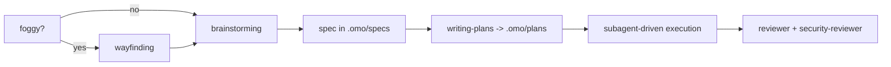

# omp-config

My [omp](https://github.com/can1357/oh-my-pi) (oh-my-pi) user config. The working tree **is** `~/.omp`, the live agent directory — the repo tracks config in place, no symlink layer.

`~/.omp` also holds credentials (`agent/agent.db` → `auth_credentials`), session transcripts, blobs and caches. `.gitignore` is therefore **default-deny**: `*` ignores everything and each hand-written config path is whitelisted explicitly. Anything new is ignored until you add it.

- [Why this instead of raw Claude Code](#why-this-instead-of-raw-claude-code)
- [Install](#install)
- [Providers](#providers)
- [Model roles](#model-roles)
- [Subagents](#subagents)
- [What is turned off, and why](#what-is-turned-off-and-why)
- [Skills](#skills)
- [Daily use](#daily-use)
- [What is tracked](#what-is-tracked)

## Why this instead of raw Claude Code

Claude Code is one vendor, one model family, one price per token. This setup keeps the same interactive coding loop but decouples three things Claude Code welds together: **who serves the model**, **which model does which job**, and **what happens when that model fails**.

| | raw Claude Code | omp + this config |
|---|---|---|
| Providers | Anthropic only | 40+ supported; 6 in this config's `modelProviderOrder`, 7 authenticated |
| Model choice | pick from the Claude family | 14 named roles, each pinned to a provider/model/thinking level |
| Per-subagent model | subagent picks a Claude tier | `task.agentModelOverrides` pins each subagent to a named role, so swapping a role re-points every agent that uses it |
| Provider outage / 429 | turn fails | `retry.fallbackChains` hands the rest of the turn to the next model, restored on cooldown |
| Cost of bulk work | metered Anthropic tokens | read-only fan-out runs on flat-rate `ollama-cloud`; the frontier models stay for synthesis |
| Code intelligence | text tools + bash | `lsp` (14 ops: real rename through `workspace/willRenameFiles`, references, code actions) and `debug` (28 DAP ops: lldb / dlv / debugpy) |
| Structural edits | string replace | `ast_grep` / `ast_edit` over 50+ tree-sitter grammars, staged then accepted |
| Edit format | full-line rewrites | hashline content-anchored patches; stale anchors are rejected instead of corrupting the file |
| Existing config | its own conventions | reads `.claude`, `.cursor`, `.codex`, `.gemini`, `.github/copilot`, `.cline`, opencode — no migration |

Concretely: the main turn is `claude-opus-5:max`, but locating code runs on `kimi-k2.7-code`, doc and API lookup on `minimax-m3`, general subagent work on `glm-5.2` — all flat-rate — and only code review reaches metered `gpt-5.6-terra`, deliberately a different family from the diff it reviews. Claude Code would bill all of it at Anthropic rates against one weekly window.

Honest caveats:

- omp is third-party. No vendor support line, and it moves fast — `agent/config.yml` keys can be renamed between releases (see `omp://settings.md` migrations).
- Check each provider's terms before routing a consumer subscription through any third-party client. For Anthropic, use official Claude Code or commercial API credentials rather than assuming Pro/Max OAuth is permitted elsewhere.
- Flat-rate tiers are the reason this is cheap and also the reason it degrades: `ollama-cloud` is capped at `maxConcurrency: 8` here, which a wide subagent fan-out saturates. That is what the fallback chains exist for.
- More moving parts than Claude Code. When a role misbehaves, the cause is usually routing, not the model.

## Install

### 1. omp

```sh
curl -fsSL https://omp.sh/install | sh     # macOS / Linux
brew install can1357/tap/omp               # Homebrew
bun install -g @oh-my-pi/pi-coding-agent   # Bun (needs bun >= 1.3.14)
```

Windows: `irm https://omp.sh/install.ps1 | iex`. Pinned: `mise use -g github:can1357/oh-my-pi`.

Shell completions are generated from live CLI metadata:

```sh
eval "$(omp completions zsh)"   # or bash; fish: omp completions fish > ~/.config/fish/completions/omp.fish
```

### 2. This config

```sh
mkdir -p ~/.omp
cd ~/.omp
git init
git remote add origin ssh://git@github.com/ismaelga/omp-config.git
git fetch origin
git checkout -f main
```

Safe against an existing `~/.omp`: state files are ignored, so checkout only lays down config. Restart omp afterwards — `config.yml`, `models.yml`, `mcp.json`, `lsp.json`, `AGENTS.md` and skills are read at session start.

### 3. Providers

Log in from inside a session; logins are provider-scoped and stored in `~/.omp/agent/agent.db`.

```
/login                      # provider selector
/login anthropic            # jump to one provider
/login <redirect-url>       # finish an OAuth flow that needs a pasted callback
/logout                     # remove stored credentials
```

Headless or shared-broker setups: `omp auth-broker login <provider>` (also `logout`, `status`, `list`, `import`, `migrate`).

Verify a provider resolves models: `omp models ollama-cloud`.

## Providers

`modelProviderOrder` here, in order, and how each is authenticated:

| Provider | Auth used here | Alternative | Role in this setup |
|---|---|---|---|
| `anthropic` | OAuth | `ANTHROPIC_API_KEY` | `default` (`claude-opus-5:max`), `plan` + `slow` (`claude-fable-5:high`) |
| `openai-codex` | OAuth (ChatGPT plan) | `OPENAI_CODEX_OAUTH_TOKEN` | `critic` (`gpt-5.6-terra`) — the one metered role, because a reviewer in the same family as the diff's author is worth little. Also the `gpt-5.6-luna` retry hop |
| `ollama-cloud` | stored API key | `OLLAMA_CLOUD_API_KEY` | flat-rate workhorse: `task`, `scout`, `librarian`, `sentinel`, `smol`, `tiny`, `vision`, `designer`, `commit` |
| `openrouter` | stored API key | `OPENROUTER_API_KEY` | the breadth tier: reaches `glm-5.3`, `kimi-k3`, `deepseek` variants that the flat-rate provider does not serve, and carries most fallback chains |
| `opencode-go` | stored API key | `OPENCODE_API_KEY` | last hop in every chain it appears in |
| `google-antigravity` | OAuth (credential present but **disabled**) | — | in the order, not currently resolvable |

`google-gemini-cli` is also authenticated but deliberately absent from `modelProviderOrder` — no role routes to it.

`OLLAMA_API_KEY` is the **local** `ollama` engine's variable, not `ollama-cloud`'s — cloud access here comes from the stored credential, not the environment.

## Model roles

`modelRoles` maps intent → model. omp picks the role; you rarely pick the model.

| Role | Model here | Why |
|---|---|---|
| `default` | `anthropic/claude-opus-5:max` | main turns: the one that reads your intent and owns the diff |
| `plan` | `anthropic/claude-fable-5:high` | plan mode and `slow` share the strongest planner in the roster |
| `slow` | `anthropic/claude-fable-5:high` | deep reasoning on demand |
| `task` | `ollama-cloud/glm-5.2` | subagent default: 1M context, flat-rate, so a wide fan-out costs latency rather than money |
| `scout` | `ollama-cloud/kimi-k2.7-code` | code-specialised locator. Output is a `file:line` table, so the win is reading a lot of code accurately, not reasoning about it |
| `librarian` | `ollama-cloud/minimax-m3` | reads library source to answer API questions — high volume in, a few verified lines out |
| `critic` | `openai-codex/gpt-5.6-terra` | code review is judgement, and every miss costs later. Deliberately a different family from `claude-opus-5`, whose diff it reads |
| `sentinel` | `ollama-cloud/glm-5.2` | security review is long-context recall over a diff *plus its callers* |
| `smol` | `ollama-cloud/minimax-m3` | cheap fan-out |
| `tiny` | `ollama-cloud/gpt-oss:20b` | session titles, memory writes, auto-thinking classification, unexpected-stop detection — highest frequency, disposable output |
| `vision` | `ollama-cloud/minimax-m3` | image reads |
| `designer` | `ollama-cloud/minimax-m3:high` | UI/UX agent |
| `commit` | `ollama-cloud/gpt-oss:120b` | one small payload per commit |
| `advisor` | `openrouter/z-ai/glm-5.3:max` | configured but inert — see [what is turned off](#what-is-turned-off-and-why) |

Model specs are `provider/model[:thinking]` where thinking ∈ `minimal|low|medium|high|xhigh|max`.

**`retry.fallbackChains`** is what makes the table hold up under load. Chains resolve by specificity — exact `provider/model-id`, then `provider/*`, then the role, then `default` — so a role-keyed chain is dead config whenever a wildcard already matches that role's model. There are none here for that reason.

Two ordering rules, both deliberate:

- **First hop is a peer, usually on another provider.** `openrouter/z-ai/glm-5.3:high` is the single most-used hop, and `z-ai/glm-5.3` is where `ollama-cloud/glm-5.2`, `gpt-5.6-luna` and every unmatched `openrouter/*` model land. Only one chain keeps the identical model — `ollama-cloud/kimi-k3` → `openrouter/moonshotai/kimi-k3:high`; elsewhere capability parity wins over family loyalty.
- **`opencode-go` goes last**, wherever it appears. It is the metered tier of last resort, so a flat-rate or plan-billed hop is always tried first. `gpt-oss:20b` never reaches it at all — it fails over inside the free tier.

## Subagents

Six bundled agents are live. `task.agentModelOverrides` pins four of them to a named role with `@role` syntax, so the model is chosen in one place (`modelRoles`) rather than duplicated per agent:

| Agent | Override | Resolves to |
|---|---|---|
| `scout` | `@scout` | `ollama-cloud/kimi-k2.7-code` |
| `librarian` | `@librarian` | `ollama-cloud/minimax-m3` |
| `reviewer` | `@critic` | `openai-codex/gpt-5.6-terra` |
| `security-reviewer` | `@sentinel` | `ollama-cloud/glm-5.2` |
| `task` | — | `modelRoles.task` (`ollama-cloud/glm-5.2`) |
| `designer` | — | `modelRoles.designer` (`ollama-cloud/minimax-m3:high`) |

The rule behind the pairings: **read-only and high volume → cheapest capable model; judgement → a different family from whatever it is checking.** `scout` and `librarian` are read-only volume work on flat-rate. `reviewer` is the only agent worth metered tokens, because it reads `claude-opus-5`'s own diff and a same-family reviewer shares its blind spots.

Also set: `task.eager: preferred` (subagents start without waiting for a full plan), `task.enableLsp: true` (agents get code intelligence, so a "missed callsite" claim is verified rather than guessed), `task.isolation.mode: none` (agents edit the working tree directly, no worktree layer).

## What is turned off, and why

Four features are configured, present on disk, and deliberately inert. They are documented because "why is this file here" is the question a future reader actually has.

| Turned off | Where | Why |
|---|---|---|
| The 14 cavecrew agents + `momus` | `task.disabledAgents` | An A/B benchmark (`~/.omp/bench/`, 2026-08-13) found minimal guidance matched or beat the full config on all 6 tasks at roughly a third of the turns and tokens — and the fleet never activated on its own. The agent definitions stay in `agent/agents/` so the experiment can be re-run under a future model regime. `sonic` is disabled too, making 16 entries |
| `advisor` | `advisor.enabled: false` | A second model reading every turn is a full extra model pass per turn. The same review, scoped to a diff and paid for once, is a `task` batch |
| `contextPromotion` | `contextPromotion.enabled: false` | Switching model on overflow instead of compacting had no published evaluation behind it. Overflow now falls back to compaction, which is the documented path. The per-model `contextPromotionTarget` entries were deleted from `models.yml` in the same pass — on their own they do nothing |
| MCP servers | `mcp.json` → `mcpServers: {}` | None currently needed. `disabledServers` keeps `pencil`, `cavemem`, `computer-use` and `sentry` from being picked up by discovery |

Re-enabling the fleet means flipping `task.disabledAgents` **and** re-reading `agent/agents/*.md` — those frontmatter models drifted while the fleet was inert and are not covered by `agentModelOverrides`.

`agent/WATCHDOG.md` (review brief) and `agent/WATCHDOG.yml` (roster granting the advisor `lsp`, withholding `bash`/`edit`/`write`) are likewise inert while `advisor.enabled` is `false`. They stay tracked because they encode two silent failure modes worth not rediscovering: only the **first** `advise` call per model turn is kept and the rest are dropped while the tool still answers `Recorded.`, and requesting a tool the advisor does not hold quarantines the **entire** turn, advice included.

## Skills

40 skill directories in `agent/skills/`, all with a `SKILL.md`. 27 are model-invoked — omp loads them automatically when the description matches, or explicitly with `/skill:<name>`. 13 are command-only (`disable-model-invocation: true`): `/skill:<name>` works but the model never auto-loads them — `ask-matt`, `grill-me`, `grill-with-docs`, `handoff`, `implement`, `improve-codebase-architecture`, `setup-matt-pocock-skills`, `teach`, `to-questionnaire`, `to-spec`, `to-tickets`, `triage`, `wait-what`.

`skills.enabled: true`, `enableSkillCommands: true`, no ignore list.

One sharp edge: omp also discovers skills from the `opencode` provider (priority 55), so the sibling [`opencode-config`](https://github.com/ismaelga/opencode-config) checkout at `~/.config/opencode/skills` can inject skills this repo has retired. Deleting a directory under `agent/skills/` does *not* stop a same-named skill loading from there. The sibling's copies of the 14 retired skills were removed 2026-08-20 to match.

**Design before code**

| Skill | For |
|---|---|
| `wayfinding` | effort too foggy for one design session: map of open questions on disk, one resolved per session |
| `brainstorming` | required before creative work: explore intent and requirements, produce a design doc |
| `grilling` | relentless interview to stress-test a plan: numbered question rounds over a design tree |
| `prototyping` | a design question that resists discussion — throwaway code answering ONE named question, then deleted |
| `baseline-first` | build the dumbest solution first; if it works you are done, and the gap defines the smart version |
| `codebase-design` | deep-module vocabulary: where seams go, what deserves an interface, testability |
| `domain-modeling` | sharpen the project's ubiquitous language into `CONTEXT.md` and ADRs |
| `to-questionnaire` | interrogate an idea into a structured questionnaire — on-ramp to `to-spec` |
| `to-spec` | turn a questionnaire or brainstorm into a spec |
| `research` | delegate primary-source reading to a background agent; findings land as a cited Markdown file |
| `writing-plans` | turn a spec into a multi-step plan in `.omo/plans/` |
| `pre-mortem` | assume the work already failed, work backwards, mitigate while it is cheap |
| `decision-log` | 5-line ADRs in `.omo/decisions/` so future-you knows *why* |

**Execution**

| Skill | For |
|---|---|
| `subagent-driven-development` | the execution path: fresh subagent per plan task, review between tasks |
| `dispatching-parallel-agents` | 2+ genuinely independent tasks, no shared state — *different problems*, run at once |
| `diverge-converge` | *one* problem, several defensible answers: N lenses on the identical question in one batch, converge on the main thread |
| `implement` | execute a spec or ticket set: TDD at pre-agreed seams, typecheck/test cadence |
| `to-tickets` | split a spec into ticket-sized tasks |
| `triage` | groom a backlog with agent briefs and scope boundaries |
| `using-git-worktrees` | isolate feature work from the current workspace |
| `resolving-merge-conflicts` | resolve an in-progress merge or rebase conflict |
| `finishing-a-development-branch` | merge / PR / cleanup decision at the end |
| `wizard` | generate an interactive bash wizard for steps only a human can perform |
| `handoff` | compact the conversation into a document the next agent picks up |

**Quality gates**

| Skill | For |
|---|---|
| `test-driven-development` | tests before implementation |
| `systematic-debugging` | any bug or unexpected behaviour, *before* proposing a fix |
| `code-review` | dispatch a review or act on one: review shape per diff, reviewer pairs, no performative agreement |
| `wait-what` | stop and re-pitch when a message did not land |

**Context and meta**

| Skill | For |
|---|---|
| `context-curation` | the context window is the bottleneck; manage it deliberately past ~30k |
| `using-superpowers` | how to find and use skills at all |
| `cavecrew` | routing table for the cavecrew presets — reference only while the fleet is disabled |
| `writing-skills` | create, edit and verify skills |
| `writing-for-agents` | write documents meant for agents: skills, `AGENTS.md`, `CLAUDE.md` |
| `ask-matt` | router: which skill or flow fits the situation |
| `teach` | agent-taught glossaries and learning records for an unfamiliar domain |
| `improve-codebase-architecture` | deepening audit across a codebase, report included |
| `setup-matt-pocock-skills` | per-project setup: issue tracker, triage labels, domain docs — run once per project |

**Caveman (output compression)**

| Skill | For |
|---|---|
| `caveman-commit` | Conventional Commits, ≤50-char subject, body only when *why* is non-obvious |

`caveman` (mode), `caveman-review`, `caveman-help` and `caveman-compress` live as slash commands in `agent/commands/`, and the compress implementation as a tool in `agent/tools/caveman-compress/` — none of them are skills anymore.

Caveman is **on by default** — `agent/AGENTS.md` carries the caveman block, so every session starts in `full` and drops out automatically for code, commits and security warnings.

## Daily use

Typical flow for a non-trivial feature:



Locating code is `scout`, library and API questions are `librarian`, and review is a `task` batch at the end rather than a model watching every turn.

Prompt keywords (plain prose, one lowercase word):

- `ultrathink` — highest automatic thinking effort
- `orchestrate` — push independent work through parallel subagents, verify each phase
- `workflowz` — build a deterministic multi-subagent workflow

Slash commands worth remembering:

| Command | What |
|---|---|
| `/model`, `Ctrl+P` | swap the active model / cycle the role's models |
| `/login`, `/logout` | provider credentials |
| `/caveman [level]`, `/caveman-help` | output compression |
| `/caveman-commit`, `/caveman-review` | commit message, review pass |
| `/review` | parallel reviewer subagents, P0–P3 verdict |
| `/vibe` | director mode over persistent worker sessions |
| `/fresh` | reset a wedged provider stream without touching the transcript |
| `/debug` | debugging, reporting, profiling tools |

CLI worth remembering:

```sh
omp                     # TUI
omp -p 'prompt'         # one-shot, exits
omp models <provider>   # verify a provider resolves models
omp stats               # local usage/cost dashboard (localhost:3847)
omp setup               # re-run the guided setup
```

Working agreements encoded in `agent/AGENTS.md`: plans in `.omo/plans/`, specs in `.omo/specs/`, decisions in `.omo/decisions/`, maps in `.omo/maps/`; "done" means the project's own test + lint + typecheck + build pass; and code slop is banned (duplicated logic, casts to silence types, tests that assert nothing, dead fallbacks, comments restating code).

## What is tracked

| Path | What |
|---|---|
| `agent/AGENTS.md` | user context: caveman block + stack map. Native provider, so it shadows `~/.config/opencode/AGENTS.md`, `~/.claude/CLAUDE.md`, `~/.codex/AGENTS.md` |
| `agent/config.yml` | model roles, provider order, fallback chains, TUI, memory, tool settings |
| `agent/models.yml` | override-only, and only two entries: corrected `gpt-5.6-luna` / `gpt-5.6-terra` prices after the 2026-07-30 cut |
| `agent/mcp.json` | empty server map plus a `disabledServers` list. Kept so discovery stays explicit |
| `agent/lsp.json` | one override: `idleTimeoutMs: 300000` |
| `agent/WATCHDOG.md` | advisor review brief — inert while `advisor.enabled: false` |
| `agent/WATCHDOG.yml` | advisor roster: one entry, widening the advisor's tool grant to include `lsp`. Also inert |
| `agent/agents/*.md` | 14 cavecrew subagents + `momus`, all in `disabledAgents`. Kept for re-measurement |
| `agent/commands/*.md` | 5 caveman slash commands + `/diverge` |
| `agent/tools/caveman-compress/` | the compress tool (scripts + docs), graduated from a skill |
| `agent/skills/*/SKILL.md` | 40 skill directories: 27 model-invoked, 13 command-only |

Everything else under `~/.omp` — `agent.db`, `history.db`, `models.db`, `sessions/`, `blobs/`, `banks/`, `cache/`, `logs/`, `run/` — is state or secrets and stays local.

One binary lives in the tool dir but is deliberately **not** tracked:
`agent/tools/yt-dlp` (37 MB Mach-O universal, currently `2026.08.19`). Vendoring it
would put a full-size blob in history on every `-U`, so `.gitignore` excludes it and
a fresh machine provisions it:

```sh
curl -fsSL -o ~/.omp/agent/tools/yt-dlp \
  https://github.com/yt-dlp/yt-dlp/releases/latest/download/yt-dlp_macos
chmod +x ~/.omp/agent/tools/yt-dlp        # brew install yt-dlp works too
```

It is not an omp integration. `agent/tools/` is a *custom-tool* discovery path and the
loader only accepts JS/TS modules exporting a factory, so a bare binary there is never
registered as a callable tool — invoke it by path (`~/.omp/agent/tools/yt-dlp`) or put it
on `PATH`.

## License and attribution

MIT, see [`LICENSE`](LICENSE). Skills and subagents here are vendored from three
upstream projects and stay under their own MIT terms (full notices in
[`NOTICE`](NOTICE)):

| Upstream | What came from it |
|---|---|
| [`obra/superpowers`](https://github.com/obra/superpowers) | 11 skills: `brainstorming`, `code-review` (modified from `requesting-code-review`), `dispatching-parallel-agents`, `finishing-a-development-branch`, `subagent-driven-development`, `systematic-debugging`, `test-driven-development`, `using-git-worktrees`, `using-superpowers`, `writing-plans`, `writing-skills` |
| [`mattpocock/skills`](https://github.com/mattpocock/skills) | 20 skills, unmodified: `ask-matt`, `codebase-design`, `domain-modeling`, `grill-me`, `grill-with-docs`, `grilling`, `handoff`, `implement`, `improve-codebase-architecture`, `research`, `resolving-merge-conflicts`, `setup-matt-pocock-skills`, `teach`, `to-questionnaire`, `to-spec`, `to-tickets`, `triage`, `wait-what`, `wizard`, `writing-for-agents` |
| [`JuliusBrussee/caveman`](https://github.com/JuliusBrussee/caveman) | the `caveman*` skills and commands, `cavecrew`, and the `cavecrew-builder` / `cavecrew-investigator` / `cavecrew-reviewer` subagents |

The remaining 7 skills (`baseline-first`, `context-curation`, `decision-log`, `diverge-converge`, `pre-mortem`, `prototyping`, `wayfinding`), the other 11 cavecrew subagents, `momus`, `agent/WATCHDOG.md`, `agent/WATCHDOG.yml`, and all config in `agent/*.yml` / `agent/*.json` are original to this repo.

Provenance is file-level, not guessed: every pre-existing tracked file was compared against the upstream git trees; the mattpocock import (2026-08-20) is unmodified upstream. Vendored files are edited freely here — do not treat them as upstream-current. One file is original despite living in a vendored directory: `test-driven-development/testing-anti-patterns.md` (superpowers' reference-doc idiom, ~10% word overlap with its `writing-good-tests.md`, which it does not replace).

## Notes

- Config changes require an omp restart.
- Sibling repo: [`opencode-config`](https://github.com/ismaelga/opencode-config), the same stack for opencode. Skills under `agent/skills/` are **copies**, not shared — editing one does not propagate, and omp's `opencode` skill provider reads `~/.config/opencode/skills`, so a skill deleted here can still load from the sibling checkout. The sibling's copies of the 14 skills retired here (the `caveman` family minus `caveman-commit`, plus `cost-aware-coding`, `eval-driven-development`, `executing-plans`, `minimum-viable-reimplementation`, `receiving-code-review`, `requesting-code-review`, `spec-driven-development`, `verification-before-completion`, `vibe-coding-guardrails`) were removed 2026-08-20 to match — keep the two checkouts in sync when retiring skills.
- `~/.codex/skills` holds 6 further skills (elixir-architect, figma, figma-implement-design, frontend-design, linear, security-best-practices) that omp loads through the `codex` discovery provider. They live in no repo yet.
