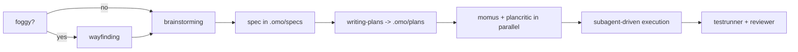

# omp-config

My [omp](https://github.com/can1357/oh-my-pi) (oh-my-pi) user config. The working tree **is** `~/.omp`, the live agent directory — the repo tracks config in place, no symlink layer.

`~/.omp` also holds credentials (`agent/agent.db` → `auth_credentials`), session transcripts, blobs and caches. `.gitignore` is therefore **default-deny**: `*` ignores everything and each hand-written config path is whitelisted explicitly. Anything new is ignored until you add it.

- [Why this instead of raw Claude Code](#why-this-instead-of-raw-claude-code)
- [Install](#install)
- [Providers](#providers)
- [Model roles](#model-roles)
- [Subagent fleet](#subagent-fleet-and-why-each-model)
- [The advisor](#the-advisor)
- [Skills](#skills)
- [Daily use](#daily-use)
- [What is tracked](#what-is-tracked)

## Why this instead of raw Claude Code

Claude Code is one vendor, one model family, one price per token. This setup keeps the same interactive coding loop but decouples three things Claude Code welds together: **who serves the model**, **which model does which job**, and **what happens when that model fails**.

| | raw Claude Code | omp + this config |
|---|---|---|
| Providers | Anthropic only | 40+ providers; this config resolves models from 6 (`anthropic`, `openai-codex`, `ollama-cloud`, `opencode-go`, `google-antigravity`, `google-gemini-cli`) plus a local `ollama` engine |
| Model choice | pick from the Claude family | 10 named roles, each pinned to a different provider/model/thinking level |
| Per-subagent model | subagent picks a Claude tier | every subagent pins its own `model:` + `thinkingLevel:` in frontmatter — 17 agents across 7 models |
| Provider outage / 429 | turn fails | `retry.fallbackChains` hands the rest of the turn to the next model, restored on cooldown |
| Context overflow | compaction (lossy) | `contextPromotion` switches to a bigger-window model instead (`gpt-5.6-luna` 272K → `glm-5.2` 1M) |
| Cost of bulk work | metered Anthropic tokens | read-only fan-out runs on flat-rate `ollama-cloud`; the frontier models stay for synthesis |
| Code intelligence | text tools + bash | `lsp` (14 ops: real rename through `workspace/willRenameFiles`, references, code actions) and `debug` (28 DAP ops: lldb / dlv / debugpy) |
| Structural edits | string replace | `ast_grep` / `ast_edit` over 50+ tree-sitter grammars, staged then accepted |
| Edit format | full-line rewrites | hashline content-anchored patches; stale anchors are rejected instead of corrupting the file |
| Second opinion | none in-loop | `advisor` role: a different model reads every turn and can inject a concern or a hard blocker, briefed by `agent/WATCHDOG.md` |
| Existing config | its own conventions | reads `.claude`, `.cursor`, `.codex`, `.gemini`, `.github/copilot`, `.cline`, opencode — no migration |

Concretely, in this config the volume work (locating code, running tests, reading git history) is done by `deepseek-v4-flash` on a flat-rate tier, the thinking work by `glm-5.2`, and only design critique reaches `gpt-5.6-sol` at `xhigh`. Claude Code would bill all of it at Anthropic rates against one weekly window.

Honest caveats:

- omp is third-party. No vendor support line, and it moves fast — `agent/config.yml` keys can be renamed between releases (see `omp://settings.md` migrations).
- Check each provider's terms before routing a consumer subscription through any third-party client. For Anthropic, use official Claude Code or commercial API credentials rather than assuming Pro/Max OAuth is permitted elsewhere.
- Flat-rate tiers are the reason this is cheap and also the reason it degrades: `ollama-cloud` is capped at `maxConcurrency: 8` here, which a wide subagent fan-out saturates. That is what the fallback chains exist for.
- More moving parts than Claude Code. When a role misbehaves, the cause is usually routing, not the model.

## Install

### 1. omp

```sh
curl -fsSL https://omp.sh/install | sh     # macOS / Linux
brew install can1357/tap/omp               # Homebrew
bun install -g @oh-my-pi/pi-coding-agent   # Bun (needs bun >= 1.3.14)
```

Windows: `irm https://omp.sh/install.ps1 | iex`. Pinned: `mise use -g github:can1357/oh-my-pi`.

Shell completions are generated from live CLI metadata:

```sh
eval "$(omp completions zsh)"   # or bash; fish: omp completions fish > ~/.config/fish/completions/omp.fish
```

### 2. This config

```sh
mkdir -p ~/.omp
cd ~/.omp
git init
git remote add origin ssh://git@github.com/ismaelga/omp-config.git
git fetch origin
git checkout -f main
```

Safe against an existing `~/.omp`: state files are ignored, so checkout only lays down config. Restart omp afterwards — `config.yml`, `models.yml`, `mcp.json`, `lsp.json`, `AGENTS.md` and skills are read at session start.

### 3. Providers

Log in from inside a session; logins are provider-scoped and stored in `~/.omp/agent/agent.db`.

```
/login                      # provider selector
/login anthropic            # jump to one provider
/login <redirect-url>       # finish an OAuth flow that needs a pasted callback
/logout                     # remove stored credentials
```

Headless or shared-broker setups: `omp auth-broker login <provider>` (also `logout`, `status`, `list`, `import`, `migrate`).

Verify a provider resolves models: `omp models ollama-cloud`.

## Providers

What this config's `modelProviderOrder` expects, and how each is authenticated here:

| Provider | Auth used here | Alternative | Role in this setup |
|---|---|---|---|
| `anthropic` | OAuth (auto-rotated with per-credential backoff; 2 credentials stored, 1 live) | `ANTHROPIC_API_KEY` | `default` (`claude-opus-5:high`), `plan` + `slow` (`claude-fable-5:high`) |
| `openai-codex` | OAuth (ChatGPT plan) | `OPENAI_CODEX_OAUTH_TOKEN` | 3 of 17 subagents where a different model family or long-context recall is the point: `cavecrew-sentinel` + `momus` (`gpt-5.6-sol`), `cavecrew-challenger` (`gpt-5.6-terra`). Also the terminal retry hop (`gpt-5.6-luna`) |
| `ollama-cloud` | stored API key via `/login ollama-cloud` | `OLLAMA_CLOUD_API_KEY` | flat-rate workhorse: `task`, `advisor`, `smol`, `tiny`, `vision`, `designer`, `commit`, and 14 of 17 subagents |
| `opencode-go` | stored API key via `/login` | `OPENCODE_API_KEY` | fallback tier only |
| `google-antigravity` | OAuth | — | available, not routed by default |
| `google-gemini-cli` | OAuth | `GEMINI_API_KEY` | available, not routed by default |

`OLLAMA_API_KEY` is the **local** `ollama` engine's variable, not `ollama-cloud`'s — cloud access here comes from the stored credential, not the environment.

Only genuinely machine-local secret: `~/.secrets/worldcoin-portal-token`, read by `agent/mcp.json` through `!echo Bearer $(cat …)`. Absent → that one MCP server fails to start, nothing else breaks.

## Model roles

`modelRoles` maps intent → model. omp picks the role; you rarely pick the model.

| Role | Model here | Why |
|---|---|---|
| `default` | `anthropic/claude-opus-5:high` | main turns: the one that reads your intent and owns the diff |
| `plan` | `anthropic/claude-fable-5:high` | plan mode and `slow` share the strongest planner in the roster |
| `slow` | `anthropic/claude-fable-5:high` | deep reasoning on demand |
| `task` | `ollama-cloud/glm-5.2:high` | subagent default. Score parity with `gpt-5.6-luna` (both 51, AA Intelligence Index v4.1), 1M context, and flat-rate — a wide fan-out costs latency, not money |
| `smol` | `ollama-cloud/minimax-m3` | cheap fan-out |
| `tiny` | `ollama-cloud/gpt-oss:20b` | session titles, memory writes, auto-thinking classification, unexpected-stop detection — highest frequency, disposable output |
| `vision` | `ollama-cloud/minimax-m3` | image reads |
| `designer` | `ollama-cloud/minimax-m3:high` | UI/UX agent |
| `commit` | `ollama-cloud/gpt-oss:120b` | one small payload per commit |
| `advisor` | `ollama-cloud/glm-5.2:high` | reads every turn on its own 1M context and must actually catch things. Flat-rate, so "cheap" is a latency question, not a bill |

Three mechanisms make the table above hold up under load:

- **`retry.fallbackChains`** — per-model chains. Flat-rate hops first, then `openai-codex/gpt-5.6-luna` as the terminal fallback, because plan-billed failover costs no new metered spend. `gpt-oss:20b` deliberately fails over *inside* the free tier. Chains resolve by specificity — exact `provider/model-id`, then `provider/*`, then the role, then `default` — so a role-keyed chain is dead config whenever a wildcard already matches that role's model. There are none here for that reason. Within a chain the **same model on another provider goes first** (`ollama-cloud/glm-5.2` → `opencode-go/glm-5.2`): a transient 429 should cost latency, not swap model family mid-task.
- **`contextPromotion`** — on overflow, switch model instead of compacting. Targets are cross-provider on purpose: every `openai-codex` model is 272K, so a same-provider target would be a no-op. `gpt-5.6-luna` → `glm-5.2` (1M) at score parity; `gpt-5.6-sol` → `claude-opus-5`; `gpt-5.6-terra` → `kimi-k3` (deliberately *not* Anthropic — `cavecrew-challenger` disputes a review of `claude-opus-5`'s own diff, so overflow must not land it in the primary's family); `kimi-k2.7-code` → `deepseek-v4-flash`. The three 1M roles (`claude-opus-5`, `claude-fable-5`, `glm-5.2`) have no target because nothing is bigger.
- **`task.disabledAgents`** — the bundled `reviewer`, `security-reviewer` and `sonic` are off. The first two have jobs that belong to `cavecrew-reviewer` + `cavecrew-challenger` and `cavecrew-sentinel`, pinned to deliberately different model families; `sonic` is a speed tier this fleet does not use.

Model specs are `provider/model[:thinking]` where thinking ∈ `minimal|low|medium|high|xhigh|max`.

## Subagent fleet, and why each model

17 agents in `agent/agents/`. The rule: **read-only + high volume → cheapest big-context model; edits → mid tier; judgement → high-thinking tier; adversarial or design critique → a different model family from whatever it is checking.**

| Agent | Model | Thinking | Why this pairing |
|---|---|---|---|
| `cavecrew-investigator` | `ollama-cloud/deepseek-v4-flash` | low | pure location work, output is a `file:line` table. 1M context swallows big repos; flat-rate so fan-out is free |
| `cavecrew-githistorian` | `deepseek-v4-flash` | low | blame / `log -S` / bisect triage — raw git output is huge, the answer is one line |
| `cavecrew-mergescout` | `deepseek-v4-flash` | low | diff and conflict inventory; volume in, table out |
| `cavecrew-testrunner` | `deepseek-v4-flash` | low | runs a command, compresses the log. No reasoning required, and test logs are exactly what you don't want in main context |
| `cavecrew-builder` | `deepseek-v4-pro` | high | 1–2 file surgical edits. Needs real code ability, not frontier judgement; 524K in / 1M out |
| `cavecrew-refactorer` | `deepseek-v4-pro` | high | behaviour-preserving cross-file change driven by `lsp rename` + `ast_grep`, so the tools carry correctness, not the model |
| `cavecrew-benchwright` | `deepseek-v4-pro` | high | measures wall time, p95, tokens, $/req; refuses wins inside the noise floor. Arithmetic discipline, not insight |
| `cavecrew-testwright` | `ollama-cloud/kimi-k2.7-code` | high | code-specialised model for writing tests that assert observable behaviour |
| `cavecrew-debugger` | `ollama-cloud/glm-5.2` | high | hypothesis → experiment → exact line. Genuinely hard reasoning, so the strongest flat-rate model at `high` |
| `cavecrew-fixscout` | `glm-5.2` | high | proposes a fix at one named depth (`simple` / `thorough` / `creative`). Spawned ×3, so it must be flat-rate |
| `cavecrew-reviewer` | `glm-5.2` | high | severity-tagged findings; judgement, and every miss costs later. Has `lsp` so a "missed callsite" claim is verified, not guessed |
| `cavecrew-evalsmith` | `glm-5.2` | high | designs scoring rubrics and runs N samples; rubric quality is the whole product |
| `cavecrew-plancritic` | `ollama-cloud/minimax-m3` | high | mechanical plan audit, deliberately a **different model family** from the reviewers so its blind spots differ |
| `cavecrew-simplifier` | `minimax-m3` | high | third review lens: what deletes, what collapses, what already earns its keep. Third family, third blind spot |
| `cavecrew-challenger` | `openai-codex/gpt-5.6-terra` | high | adversarial second pass over `cavecrew-reviewer`'s report. Pointless on the same family, so it rides the ChatGPT plan |
| `cavecrew-sentinel` | `openai-codex/gpt-5.6-sol` | high | security audit is long-context recall over a diff *plus its callers* — `glm-5.2` was the wrong tool and this is the one axis worth plan tokens |
| `momus` | `openai-codex/gpt-5.6-sol` | xhigh | design-level critic: right problem, hidden coupling, missing rollback, unfalsifiable acceptance criteria. Runs rarely, on plans only, where being wrong is most expensive |

Pairing is the point, not redundancy:

- **Plan review** — `momus` + `cavecrew-plancritic` in parallel: one design pass, one mechanical pass, two families.
- **Diff review** — `cavecrew-reviewer`, then `cavecrew-challenger` on its report; or all three lenses (`reviewer` + `sentinel` + `simplifier`, three families) at once via `skill://diverge-converge`.
- **Fix depth** — `cavecrew-fixscout` ×3 at `simple` / `thorough` / `creative`, once `cavecrew-debugger` has the cause. The converge always happens on the main thread.

Every agent also declares a narrowed `tools:` list — read-only agents (`investigator`, `githistorian`, `testrunner`, `reviewer`, `challenger`, `simplifier`, `sentinel`, `fixscout`, `plancritic`, `momus`) have no `edit`/`write` at all, so "read-only" is enforced by the harness rather than by the prompt.

Six agents also set `read-summarize: false`: `cavecrew-reviewer`, `cavecrew-challenger`, `cavecrew-sentinel`, `cavecrew-simplifier`, `cavecrew-fixscout`, `cavecrew-testwright`. By default a bare `read` of a file over 100 lines returns a **structural summary** — declarations kept, bodies replaced by `…` — and recovering the elided ranges takes a second, selector-scoped read the model has to remember to issue. Measured on a 170-line fixture: `cavecrew-investigator` (default) got 110 lines elided and could not see inside any function body; `cavecrew-reviewer` got all 170 lines verbatim. A summary is the right default for a locator and the wrong one for anything that judges or writes code from what it read — a finding inside an elided body is a finding that never happens.

## The advisor

`advisor.enabled: true` attaches a second model to every session. It reads each turn on its
own context, investigates with `read`/`grep`/`glob`/`lsp`, and injects `nit` / `concern` /
`blocker` notes back into the primary transcript. A `concern` or `blocker` steers the live
turn; a `nit` batches in at the next step boundary.

| Setting | Here | Why |
|---|---|---|
| `modelRoles.advisor` | `ollama-cloud/glm-5.2:high` | 1M context, flat-rate. A reviewer weaker than the thing it reviews is worse than none |
| `advisor.syncBacklog` | `3` | the primary pauses (≤30s) only once the advisor is 3 deltas behind, so advice lands on live work instead of stale work. Default `off` lets the reviewer fall arbitrarily far behind |
| `advisor.subagents` | default `false` | one reviewer, on the thread that owns the diff |

Two files configure it, and they answer different questions.

[`agent/WATCHDOG.md`](agent/WATCHDOG.md) is **what to look for** — appended to the advisor's
system prompt only, never to the main agent's context. It exists because an unbriefed advisor
writes advisories any generic reviewer could have written without reading the transcript.
It also documents two delivery mechanics that silently destroy work when ignored:

- **One `advise` call per update.** An emission guard accepts the first note per model turn
  and drops the rest, while the tool still answers `Recorded.` — the model cannot tell. One
  measured session made 63 calls; 25 were discarded this way.
- **No `bash`, no `edit`.** Requesting a tool the advisor does not hold quarantines the
  *entire* turn, advice included, before dispatch. That cost 15 whole turns before the brief
  spelled it out.

Both are worth knowing before writing your own `WATCHDOG.md`: the failure mode is silent,
so a broken advisor looks exactly like a quiet one.

[`agent/WATCHDOG.yml`](agent/WATCHDOG.yml) is **what it may touch**. The default advisor grant
is `read`/`grep`/`glob`, and there is no `advisor.tools` config key — a roster entry is the
only place to widen it. This one adds `lsp`, because two of the catches `WATCHDOG.md` asks
for (wrong-symbol edits, cross-file renames done by text search) cannot be verified without
`lsp references`, and a guessed callsite claim is the false positive that gets an advisor
ignored. `bash`, `edit` and `write` stay out: the advisor runs unattended, and every mutating
grant fires real approval prompts from a background reviewer. One entry on purpose — each
roster entry is a full extra model pass over *every* turn.

## Skills

40 skill directories in `agent/skills/`. 27 are model-invoked — omp loads them automatically when the description matches, or explicitly with `/skill:<name>`. 13 are command-only (`disable-model-invocation: true` in frontmatter): `/skill:<name>` works but the model never auto-loads them — `ask-matt`, `grill-me`, `grill-with-docs`, `handoff`, `implement`, `improve-codebase-architecture`, `setup-matt-pocock-skills`, `teach`, `to-questionnaire`, `to-spec`, `to-tickets`, `triage`, `wait-what`.

`skills.enabled: true`, `enableSkillCommands: true`, no ignore list. omp discovers skills from the `opencode` provider too (priority 55), so the sibling [`opencode-config`](https://github.com/ismaelga/opencode-config) checkout at `~/.config/opencode/skills` can inject skills this repo has retired — deleting a directory under `agent/skills/` does *not* stop a same-named skill loading from there. The sibling's copies of the 14 retired skills were removed 2026-08-20 to match.

**Design before code**

| Skill | For |
|---|---|
| `wayfinding` | effort too foggy for one design session: map of open questions on disk, one resolved per session |
| `brainstorming` | required before creative work: explore intent and requirements, produce a design doc |
| `grilling` | relentless interview to stress-test a plan: numbered question rounds over a design tree |
| `prototyping` | a design question that resists discussion — throwaway code answering ONE named question, then deleted |
| `baseline-first` | build the dumbest solution first; if it works you are done, and the gap defines the smart version |
| `codebase-design` | deep-module vocabulary: where seams go, what deserves an interface, testability |
| `domain-modeling` | sharpen the project's ubiquitous language into `CONTEXT.md` and ADRs |
| `to-questionnaire` | interrogate an idea into a structured questionnaire — on-ramp to `to-spec` |
| `to-spec` | turn a questionnaire or brainstorm into a spec |
| `research` | delegate primary-source reading to a background agent; findings land as a cited Markdown file |
| `writing-plans` | turn a spec into a multi-step plan in `.omo/plans/` |
| `pre-mortem` | assume the work already failed, work backwards, mitigate while it is cheap |
| `decision-log` | 5-line ADRs in `.omo/decisions/` so future-you knows *why* |

**Execution**

| Skill | For |
|---|---|
| `subagent-driven-development` | the execution path: fresh subagent per plan task, review between tasks |
| `dispatching-parallel-agents` | 2+ genuinely independent tasks, no shared state — *different problems*, run at once |
| `diverge-converge` | *one* problem, several defensible answers: N lenses on the identical question in one batch, converge on the main thread |
| `implement` | execute a spec or ticket set: TDD at pre-agreed seams, typecheck/test cadence |
| `to-tickets` | split a spec into ticket-sized tasks |
| `triage` | groom a backlog with agent briefs and scope boundaries |
| `using-git-worktrees` | isolate feature work from the current workspace |
| `resolving-merge-conflicts` | resolve an in-progress merge or rebase conflict |
| `finishing-a-development-branch` | merge / PR / cleanup decision at the end |
| `wizard` | generate an interactive bash wizard for steps only a human can perform |
| `handoff` | compact the conversation into a document the next agent picks up |

**Quality gates**

| Skill | For |
|---|---|
| `test-driven-development` | tests before implementation |
| `systematic-debugging` | any bug or unexpected behaviour, *before* proposing a fix |
| `code-review` | dispatch a review or act on one: review shape per diff, reviewer pairs, no performative agreement |
| `wait-what` | stop and re-pitch when a message did not land |

**Context and meta**

| Skill | For |
|---|---|
| `context-curation` | the context window is the bottleneck; manage it deliberately past ~30k |
| `using-superpowers` | how to find and use skills at all |
| `cavecrew` | routing table for the 14 cavecrew presets, with overlap tiebreakers |
| `writing-skills` | create, edit and verify skills |
| `writing-for-agents` | write documents meant for agents: skills, `AGENTS.md`, `CLAUDE.md` |
| `ask-matt` | router: which skill or flow fits the situation |
| `teach` | agent-taught glossaries and learning records for an unfamiliar domain |
| `improve-codebase-architecture` | deepening audit across a codebase, report included |
| `setup-matt-pocock-skills` | per-project setup: issue tracker, triage labels, domain docs — run once per project |

**Caveman (output compression)**

| Skill | For |
|---|---|
| `caveman-commit` | Conventional Commits, ≤50-char subject, body only when *why* is non-obvious |

`caveman` (mode), `caveman-review` and `caveman-help` live as slash commands in `agent/commands/`, and `caveman-compress` as a tool in `agent/tools/caveman-compress/` — none of them are skills anymore.

Caveman is **on by default** — `agent/AGENTS.md` carries the caveman block, so every session starts in `full` and drops out automatically for code, commits and security warnings.

## Daily use

Typical flow for a non-trivial feature:



Prompt keywords (plain prose, one lowercase word):

- `ultrathink` — highest automatic thinking effort
- `orchestrate` — push independent work through parallel subagents, verify each phase
- `workflowz` — build a deterministic multi-subagent workflow

Slash commands worth remembering:

| Command | What |
|---|---|
| `/model`, `Ctrl+P` | swap the active model / cycle the role's models |
| `/login`, `/logout` | provider credentials |
| `/caveman [level]`, `/caveman-help` | output compression |
| `/caveman-commit`, `/caveman-review` | commit message, review pass |
| `/review` | parallel reviewer subagents, P0–P3 verdict |
| `/advisor status` | the second model watching each turn |
| `/vibe` | director mode over persistent worker sessions |
| `/fresh` | reset a wedged provider stream without touching the transcript |
| `/debug` | debugging, reporting, profiling tools |

CLI worth remembering:

```sh
omp                     # TUI
omp -p 'prompt'         # one-shot, exits
omp models <provider>   # verify a provider resolves models
omp stats               # local usage/cost dashboard (localhost:3847)
omp setup               # re-run the guided setup
```

Working agreements encoded in `agent/AGENTS.md`: plans in `.omo/plans/`, specs in `.omo/specs/`, delegate whenever work splits into independent specialists, "done" means the project's own test + lint + typecheck + build pass, and code slop is banned (duplicated logic, casts to silence types, tests that assert nothing, dead fallbacks, comments restating code).

## What is tracked

| Path | What |
|---|---|
| `agent/AGENTS.md` | user context: caveman block + stack map. Native provider, so it shadows `~/.config/opencode/AGENTS.md`, `~/.claude/CLAUDE.md`, `~/.codex/AGENTS.md` |
| `agent/config.yml` | model roles, provider order, fallback chains, TUI, memory, tool settings |
| `agent/models.yml` | override-only: `contextPromotionTarget` per model + corrected `gpt-5.6-luna`/`terra` prices |
| `agent/mcp.json` | MCP servers. Secrets via `!` shell substitution, never inline |
| `agent/lsp.json` | LSP overrides |
| `agent/WATCHDOG.md` | advisor-only review brief: what to flag, what to stay silent about, how notes are delivered |
| `agent/WATCHDOG.yml` | advisor roster: one entry, widening the advisor's tool grant to include `lsp` |
| `agent/agents/*.md` | 14 cavecrew subagents + `momus` |
| `agent/commands/*.md` | caveman slash commands + `/diverge` |
| `agent/tools/caveman-compress/` | the compress tool (scripts + docs), graduated from a skill |
| `agent/skills/*/SKILL.md` | 40 skill directories: 27 model-invoked, 13 command-only |

Everything else under `~/.omp` — `agent.db`, `history.db`, `models.db`, `sessions/`, `blobs/`, `banks/`, `cache/`, `logs/`, `run/` — is state or secrets and stays local.

One binary lives in the tool dir but is deliberately **not** tracked:
`agent/tools/yt-dlp` (37 MB Mach-O universal, currently `2026.08.19`). Vendoring it
would put a full-size blob in history on every `-U`, so `.gitignore` excludes it and
a fresh machine provisions it:

```sh
curl -fsSL -o ~/.omp/agent/tools/yt-dlp \
  https://github.com/yt-dlp/yt-dlp/releases/latest/download/yt-dlp_macos
chmod +x ~/.omp/agent/tools/yt-dlp        # brew install yt-dlp works too
```

It is not an omp integration. `agent/tools/` is a *custom-tool* discovery path and the
loader only accepts JS/TS modules exporting a factory, so a bare binary there is never
registered as a callable tool — invoke it by path (`~/.omp/agent/tools/yt-dlp`) or put it
on `PATH`.

## License and attribution

MIT, see [`LICENSE`](LICENSE). Skills and subagents here are vendored from three
upstream projects and stay under their own MIT terms (full notices in
[`NOTICE`](NOTICE)):

| Upstream | What came from it |
|---|---|
| [`obra/superpowers`](https://github.com/obra/superpowers) | 11 skills: `brainstorming`, `code-review` (modified from `requesting-code-review`), `dispatching-parallel-agents`, `finishing-a-development-branch`, `subagent-driven-development`, `systematic-debugging`, `test-driven-development`, `using-git-worktrees`, `using-superpowers`, `writing-plans`, `writing-skills` |
| [`mattpocock/skills`](https://github.com/mattpocock/skills) | 20 skills, unmodified: `ask-matt`, `codebase-design`, `domain-modeling`, `grill-me`, `grill-with-docs`, `grilling`, `handoff`, `implement`, `improve-codebase-architecture`, `research`, `resolving-merge-conflicts`, `setup-matt-pocock-skills`, `teach`, `to-questionnaire`, `to-spec`, `to-tickets`, `triage`, `wait-what`, `wizard`, `writing-for-agents` |
| [`JuliusBrussee/caveman`](https://github.com/JuliusBrussee/caveman) | the `caveman*` skills and commands, `cavecrew`, and the `cavecrew-builder` / `cavecrew-investigator` / `cavecrew-reviewer` subagents |

The remaining 7 skills (`baseline-first`, `context-curation`, `decision-log`, `diverge-converge`, `pre-mortem`, `prototyping`, `wayfinding`), the other 11 cavecrew subagents, `momus`, `agent/WATCHDOG.md`, `agent/WATCHDOG.yml`, and all config in `agent/*.yml` / `agent/*.json` are original to this repo.

Provenance is file-level, not guessed: every pre-existing tracked file was compared against the upstream git trees; the mattpocock import (2026-08-20) is unmodified upstream. Vendored files are edited freely here — do not treat them as upstream-current. One file is original despite living in a vendored directory: `test-driven-development/testing-anti-patterns.md` (superpowers' reference-doc idiom, ~10% word overlap with its `writing-good-tests.md`, which it does not replace).

## Notes

- Config changes require an omp restart.
- Sibling repo: [`opencode-config`](https://github.com/ismaelga/opencode-config), the same stack for opencode. Skills under `agent/skills/` are **copies**, not shared — editing one does not propagate. They are not invisible to each other either: omp's `opencode` skill provider reads `~/.config/opencode/skills`, so a skill deleted here can still load from the sibling checkout. The sibling's copies of the 14 skills retired here (the `caveman` family minus `caveman-commit`, plus `cost-aware-coding`, `eval-driven-development`, `executing-plans`, `minimum-viable-reimplementation`, `receiving-code-review`, `requesting-code-review`, `spec-driven-development`, `verification-before-completion`, `vibe-coding-guardrails`) were removed 2026-08-20 to match — keep the two checkouts in sync when retiring skills.
- `~/.codex/skills` holds 6 further skills (elixir-architect, figma, figma-implement-design, frontend-design, linear, security-best-practices) that omp loads through the `codex` discovery provider. They live in no repo yet.
