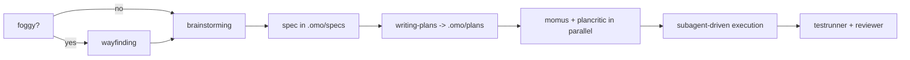

# omp-config

My [omp](https://github.com/can1357/oh-my-pi) (oh-my-pi) user config. The working tree **is** `~/.omp`, the live agent directory — the repo tracks config in place, no symlink layer.

`~/.omp` also holds credentials (`agent/agent.db` → `auth_credentials`), session transcripts, blobs and caches. `.gitignore` is therefore **default-deny**: `*` ignores everything and each hand-written config path is whitelisted explicitly. Anything new is ignored until you add it.

- [Why this instead of raw Claude Code](#why-this-instead-of-raw-claude-code)
- [Install](#install)
- [Providers](#providers)
- [Model roles](#model-roles)
- [Subagent fleet](#subagent-fleet-and-why-each-model)
- [Skills](#skills)
- [Daily use](#daily-use)
- [What is tracked](#what-is-tracked)

## Why this instead of raw Claude Code

Claude Code is one vendor, one model family, one price per token. This setup keeps the same interactive coding loop but decouples three things Claude Code welds together: **who serves the model**, **which model does which job**, and **what happens when that model fails**.

| | raw Claude Code | omp + this config |
|---|---|---|
| Providers | Anthropic only | 40+ providers; this config authenticates 7 (`anthropic` ×3 accounts, `openai-codex`, `ollama-cloud`, `opencode-go`, `cursor`, `google-antigravity`, `google-gemini-cli`) |
| Model choice | pick from the Claude family | 10 named roles, each pinned to a different provider/model/thinking level |
| Per-subagent model | subagent picks a Claude tier | every subagent pins its own `model:` + `thinkingLevel:` in frontmatter — 14 agents across 5 models |
| Provider outage / 429 | turn fails | `retry.fallbackChains` hands the rest of the turn to the next model, restored on cooldown |
| Context overflow | compaction (lossy) | `contextPromotion` switches to a bigger-window model instead (`gpt-5.6-luna` 272K → `glm-5.2` 1M) |
| Cost of bulk work | metered Anthropic tokens | read-only fan-out runs on flat-rate `ollama-cloud`; the frontier models stay for synthesis |
| Code intelligence | text tools + bash | `lsp` (14 ops: real rename through `workspace/willRenameFiles`, references, code actions) and `debug` (28 DAP ops: lldb / dlv / debugpy) |
| Structural edits | string replace | `ast_grep` / `ast_edit` over 50+ tree-sitter grammars, staged then accepted |
| Edit format | full-line rewrites | hashline content-anchored patches; stale anchors are rejected instead of corrupting the file |
| Second opinion | none in-loop | `advisor` role: a different model reads every turn and can inject a concern or a hard blocker |
| Existing config | its own conventions | reads `.claude`, `.cursor`, `.codex`, `.gemini`, `.github/copilot`, `.cline`, opencode — no migration |

Concretely, in this config the volume work (locating code, running tests, reading git history) is done by `deepseek-v4-flash` on a flat-rate tier, the thinking work by `glm-5.2`, and only design critique reaches `gpt-5.6-sol` at `xhigh`. Claude Code would bill all of it at Anthropic rates against one weekly window.

Honest caveats:

- omp is third-party. No vendor support line, and it moves fast — `agent/config.yml` keys can be renamed between releases (see `omp://settings.md` migrations).
- Check each provider's terms before routing a consumer subscription through any third-party client. For Anthropic, use official Claude Code or commercial API credentials rather than assuming Pro/Max OAuth is permitted elsewhere.
- Flat-rate tiers are the reason this is cheap and also the reason it degrades: `ollama-cloud` is capped at `maxConcurrency: 8` here, which a wide subagent fan-out saturates. That is what the fallback chains exist for.
- More moving parts than Claude Code. When a role misbehaves, the cause is usually routing, not the model.

## Install

### 1. omp

```sh
curl -fsSL https://omp.sh/install | sh     # macOS / Linux
brew install can1357/tap/omp               # Homebrew
bun install -g @oh-my-pi/pi-coding-agent   # Bun (needs bun >= 1.3.14)
```

Windows: `irm https://omp.sh/install.ps1 | iex`. Pinned: `mise use -g github:can1357/oh-my-pi`.

Shell completions are generated from live CLI metadata:

```sh
eval "$(omp completions zsh)"   # or bash; fish: omp completions fish > ~/.config/fish/completions/omp.fish
```

### 2. This config

```sh
mkdir -p ~/.omp
cd ~/.omp
git init
git remote add origin ssh://git@github.com/ismaelga/omp-config.git
git fetch origin
git checkout -f main
```

Safe against an existing `~/.omp`: state files are ignored, so checkout only lays down config. Restart omp afterwards — `config.yml`, `models.yml`, `mcp.json`, `lsp.json`, `AGENTS.md` and skills are read at session start.

### 3. Providers

Log in from inside a session; logins are provider-scoped and stored in `~/.omp/agent/agent.db`.

```
/login                      # provider selector
/login anthropic            # jump to one provider
/login <redirect-url>       # finish an OAuth flow that needs a pasted callback
/logout                     # remove stored credentials
```

Headless or shared-broker setups: `omp auth-broker login <provider>` (also `logout`, `status`, `list`, `import`, `migrate`).

Verify a provider resolves models: `omp models ollama-cloud`.

## Providers

What this config's `modelProviderOrder` expects, and how each is authenticated here:

| Provider | Auth used here | Alternative | Role in this setup |
|---|---|---|---|
| `anthropic` | OAuth, **3 accounts** (auto-rotated with per-credential backoff) | `ANTHROPIC_API_KEY` | `default` + `plan` roles — `claude-opus-5:high` |
| `openai-codex` | OAuth (ChatGPT plan) | `OPENAI_CODEX_OAUTH_TOKEN` | `task` (`gpt-5.6-luna:max`), `slow` (`gpt-5.6-sol:high`), reviewer override (`gpt-5.6-terra:high`), `momus` |
| `ollama-cloud` | stored API key via `/login ollama-cloud` | `OLLAMA_CLOUD_API_KEY` | flat-rate workhorse: `smol`, `tiny`, `vision`, `designer`, `commit`, `advisor`, and 13 of 14 subagents |
| `opencode-go` | stored API key via `/login` | `OPENCODE_API_KEY` | fallback tier only |
| `cursor` | OAuth | `CURSOR_ACCESS_TOKEN` | available, not routed by default |
| `google-antigravity` | OAuth | — | available, not routed by default |

`OLLAMA_API_KEY` is the **local** `ollama` engine's variable, not `ollama-cloud`'s — cloud access here comes from the stored credential, not the environment.

Only genuinely machine-local secret: `~/.secrets/worldcoin-portal-token`, read by `agent/mcp.json` through `!echo Bearer $(cat …)`. Absent → that one MCP server fails to start, nothing else breaks.

## Model roles

`modelRoles` maps intent → model. omp picks the role; you rarely pick the model.

| Role | Model here | Why |
|---|---|---|
| `default` | `anthropic/claude-opus-5:high` | main turns: the one that reads your intent and owns the diff |
| `plan` | `anthropic/claude-opus-5:high` | plan mode shares the strongest reader |
| `task` | `openai-codex/gpt-5.6-luna:max` | subagent default. Score-parity with `glm-5.2:max` (both 51, AA Intelligence Index v4.1) but faster, and rides the already-paid ChatGPT plan instead of the 8-slot `ollama-cloud` cap |
| `slow` | `openai-codex/gpt-5.6-sol:high` | deep reasoning on demand |
| `smol` | `ollama-cloud/minimax-m3` | cheap fan-out |
| `tiny` | `ollama-cloud/gpt-oss:20b` | session titles, memory writes, auto-thinking classification, unexpected-stop detection — highest frequency, disposable output |
| `vision` | `ollama-cloud/minimax-m3` | image reads |
| `designer` | `ollama-cloud/minimax-m3:high` | UI/UX agent |
| `commit` | `ollama-cloud/gpt-oss:120b` | one small payload per commit |
| `advisor` | `ollama-cloud/minimax-m3:low` | watches every turn on its own context; must be cheap or it doubles the bill |

Three mechanisms make the table above hold up under load:

- **`retry.fallbackChains`** — per-model chains. Flat-rate hops first, then `openai-codex/gpt-5.6-luna` as the terminal fallback, because plan-billed failover costs no new metered spend. `gpt-oss:20b` deliberately fails over *inside* the free tier.
- **`contextPromotion`** — on overflow, switch model instead of compacting. Targets are cross-provider on purpose: every `openai-codex` model is 272K, so a same-provider target would be a no-op. `gpt-5.6-luna` → `glm-5.2` (1M) at score parity; `gpt-5.6-sol` → `claude-opus-5`.
- **`task.agentModelOverrides`** — the bundled `reviewer` is pinned to `gpt-5.6-terra:high` so it stops drawing the same Codex window as `sol`.

Model specs are `provider/model[:thinking]` where thinking ∈ `minimal|low|medium|high|xhigh|max`.

## Subagent fleet, and why each model

14 agents in `agent/agents/`. The rule: **read-only + high volume → cheapest big-context model; edits → mid tier; judgement → high-thinking tier; design critique → frontier.**

| Agent | Model | Thinking | Why this pairing |
|---|---|---|---|
| `cavecrew-investigator` | `ollama-cloud/deepseek-v4-flash` | low | pure location work, output is a `file:line` table. 1M context swallows big repos; flat-rate so fan-out is free |
| `cavecrew-githistorian` | `deepseek-v4-flash` | low | blame / `log -S` / bisect triage — raw git output is huge, the answer is one line |
| `cavecrew-mergescout` | `deepseek-v4-flash` | low | diff and conflict inventory; volume in, table out |
| `cavecrew-testrunner` | `deepseek-v4-flash` | low | runs a command, compresses the log. No reasoning required, and test logs are exactly what you don't want in main context |
| `cavecrew-builder` | `deepseek-v4-pro` | medium | 1–2 file surgical edits. Needs real code ability, not frontier judgement; 524K in / 1M out |
| `cavecrew-refactorer` | `deepseek-v4-pro` | medium | behaviour-preserving cross-file change driven by `lsp rename` + `ast_grep`, so the tools carry correctness, not the model |
| `cavecrew-benchwright` | `deepseek-v4-pro` | medium | measures wall time, p95, tokens, $/req; refuses wins inside the noise floor. Arithmetic discipline, not insight |
| `cavecrew-testwright` | `ollama-cloud/kimi-k2.7-code` | medium | code-specialised model for writing tests that assert observable behaviour |
| `cavecrew-debugger` | `ollama-cloud/glm-5.2` | high | hypothesis → experiment → exact line. Genuinely hard reasoning, so the strongest flat-rate model at `high` |
| `cavecrew-reviewer` | `glm-5.2` | high | severity-tagged findings; judgement, and every miss costs later |
| `cavecrew-sentinel` | `glm-5.2` | high | security audit — must name the exploit path, not pattern-match keywords |
| `cavecrew-evalsmith` | `glm-5.2` | high | designs scoring rubrics and runs N samples; rubric quality is the whole product |
| `cavecrew-plancritic` | `ollama-cloud/minimax-m3` | high | mechanical plan audit, deliberately a **different model family** from the reviewers so its blind spots differ |
| `momus` | `openai-codex/gpt-5.6-sol` | xhigh | design-level critic: right problem, hidden coupling, missing rollback, unfalsifiable acceptance criteria. Runs rarely, on plans only, where being wrong is most expensive — the one place worth frontier tokens |

Plan review runs `momus` + `cavecrew-plancritic` in **parallel** on purpose: one design pass, one mechanical pass, two model families, no shared blind spot.

Every agent also declares a narrowed `tools:` list — read-only agents (`investigator`, `githistorian`, `mergescout`, `reviewer`, `sentinel`, `plancritic`, `momus`) have no `edit`/`write` at all, so "read-only" is enforced by the harness rather than by the prompt.

## Skills

31 skills in `agent/skills/`. Vendored — edit them, they are yours. Model-invoked automatically when the description matches, or explicitly with `/skill:<name>`.

**Design before code**

| Skill | For |
|---|---|
| `wayfinding` | effort too foggy for one design session: map of open questions on disk, one resolved per session |
| `brainstorming` | required before creative work: explore intent and requirements, produce a design doc |
| `prototyping` | a design question that resists discussion — throwaway code answering ONE named question, then deleted |
| `baseline-first` | build the dumbest solution first; if it works you are done, and the gap defines the smart version |
| `spec-driven-development` | chains brainstorm → spec → tests → implementation as one pipeline |
| `writing-plans` | turn a spec into a multi-step plan in `.omo/plans/` |
| `pre-mortem` | assume the work already failed, work backwards, mitigate while it is cheap |
| `decision-log` | 5-line ADRs in `.omo/decisions/` so future-you knows *why* |

**Execution**

| Skill | For |
|---|---|
| `subagent-driven-development` | the execution path: fresh subagent per plan task, review between tasks |
| `dispatching-parallel-agents` | 2+ genuinely independent tasks, no shared state |
| `using-git-worktrees` | isolate feature work from the current workspace |
| `finishing-a-development-branch` | merge / PR / cleanup decision at the end |
| `executing-plans` | deprecated, kept for reference — use subagent-driven instead |

**Quality gates**

| Skill | For |
|---|---|
| `test-driven-development` | tests before implementation |
| `systematic-debugging` | any bug or unexpected behaviour, *before* proposing a fix |
| `verification-before-completion` | evidence before claiming done — run the command, read the output |
| `requesting-code-review` | package a change for review properly |
| `receiving-code-review` | verify feedback technically instead of agreeing performatively |
| `eval-driven-development` | non-deterministic behaviour (prompts, agent loops) needs pass-rates, not unit tests |
| `vibe-coding-guardrails` | autonomous long runs: the line between vibe coding and slop is whether you read the diff |

**Cost and context**

| Skill | For |
|---|---|
| `cost-aware-coding` | treat $/request as a first-class metric while building LLM features |
| `context-curation` | the context window is the bottleneck; manage it deliberately past ~30k |

**Meta**

| Skill | For |
|---|---|
| `using-superpowers` | how to find and use skills at all |
| `cavecrew` | routing table for the 14 subagents, with overlap tiebreakers |
| `writing-skills` | create, edit and verify skills |
| `minimum-viable-reimplementation` | rewrite a misbehaving library slice in 50–200 lines to build a real mental model |

**Caveman (output compression)**

| Skill | For |
|---|---|
| `caveman` | terse mode: `lite` / `full` / `ultra` / `wenyan*`. Cuts ~75% of output tokens, keeps technical substance |
| `caveman-commit` | Conventional Commits, ≤50-char subject, body only when *why* is non-obvious |
| `caveman-review` | one line per finding: `path:line: severity: problem. fix.` |
| `caveman-compress` | compress a memory/context file in place, human-readable backup kept |
| `caveman-help` | the reference card |

Caveman is **on by default** — `agent/AGENTS.md` carries the caveman block, so every session starts in `full` and drops out automatically for code, commits and security warnings.

## Daily use

Typical flow for a non-trivial feature:



Prompt keywords (plain prose, one lowercase word):

- `ultrathink` — highest automatic thinking effort
- `orchestrate` — push independent work through parallel subagents, verify each phase
- `workflowz` — build a deterministic multi-subagent workflow

Slash commands worth remembering:

| Command | What |
|---|---|
| `/model`, `Ctrl+P` | swap the active model / cycle the role's models |
| `/login`, `/logout` | provider credentials |
| `/caveman [level]`, `/caveman-help` | output compression |
| `/caveman-commit`, `/caveman-review` | commit message, review pass |
| `/review` | parallel reviewer subagents, P0–P3 verdict |
| `/advisor status` | the second model watching each turn |
| `/vibe` | director mode over persistent worker sessions |
| `/fresh` | reset a wedged provider stream without touching the transcript |
| `/debug` | debugging, reporting, profiling tools |

CLI worth remembering:

```sh
omp                     # TUI
omp -p 'prompt'         # one-shot, exits
omp models <provider>   # verify a provider resolves models
omp stats               # local usage/cost dashboard (localhost:3847)
omp setup               # re-run the guided setup
```

Working agreements encoded in `agent/AGENTS.md`: plans in `.omo/plans/`, specs in `.omo/specs/`, delegate whenever work splits into independent specialists, "done" means the project's own test + lint + typecheck + build pass, and code slop is banned (duplicated logic, casts to silence types, tests that assert nothing, dead fallbacks, comments restating code).

## What is tracked

| Path | What |
|---|---|
| `agent/AGENTS.md` | user context: caveman block + stack map. Native provider, so it shadows `~/.config/opencode/AGENTS.md`, `~/.claude/CLAUDE.md`, `~/.codex/AGENTS.md` |
| `agent/config.yml` | model roles, provider order, fallback chains, TUI, memory, tool settings |
| `agent/models.yml` | override-only: `contextPromotionTarget` per model + corrected `gpt-5.6-luna`/`terra` prices |
| `agent/mcp.json` | MCP servers. Secrets via `!` shell substitution, never inline |
| `agent/lsp.json` | LSP overrides |
| `agent/agents/*.md` | 13 cavecrew subagents + `momus` |
| `agent/commands/*.md` | caveman slash commands |
| `agent/skills/*/SKILL.md` | 31 vendored skills |

Everything else under `~/.omp` — `agent.db`, `history.db`, `models.db`, `sessions/`, `blobs/`, `banks/`, `cache/`, `logs/`, `run/` — is state or secrets and stays local.

## License and attribution

MIT, see [`LICENSE`](LICENSE). Skills and subagents here are vendored from two
upstream projects and stay under their own MIT terms (full notices in
[`NOTICE`](NOTICE)):

| Upstream | What came from it |
|---|---|
| [`obra/superpowers`](https://github.com/obra/superpowers) | 14 skills: `brainstorming`, `dispatching-parallel-agents`, `executing-plans`, `finishing-a-development-branch`, `receiving-code-review`, `requesting-code-review`, `subagent-driven-development`, `systematic-debugging`, `test-driven-development`, `using-git-worktrees`, `using-superpowers`, `verification-before-completion`, `writing-plans`, `writing-skills` |
| [`JuliusBrussee/caveman`](https://github.com/JuliusBrussee/caveman) | the `caveman*` skills, `cavecrew`, `agent/commands/*`, and the `cavecrew-builder` / `cavecrew-investigator` / `cavecrew-reviewer` subagents |

The remaining 11 skills (`baseline-first`, `context-curation`, `cost-aware-coding`, `decision-log`, `eval-driven-development`, `minimum-viable-reimplementation`, `pre-mortem`, `prototyping`, `spec-driven-development`, `vibe-coding-guardrails`, `wayfinding`), the other 10 cavecrew subagents, `momus`, and all config in `agent/*.yml` / `agent/*.json` are original to this repo. Vendored files are modified, sometimes heavily — do not treat them as upstream-current.

## Notes

- Config changes require an omp restart.
- Sibling repo: [`opencode-config`](https://github.com/ismaelga/opencode-config), the same stack for opencode. Skills under `agent/skills/` are **copies**, not shared — editing one does not propagate.
- `caveman-stats` is not vendored here: it is delivered by an opencode plugin hook with no omp equivalent.
- `~/.codex/skills` holds 6 further skills (elixir-architect, figma, figma-implement-design, frontend-design, linear, security-best-practices) that omp loads through the `codex` discovery provider. They live in no repo yet.
