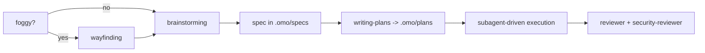

# omp-config

My [omp](https://github.com/can1357/oh-my-pi) (oh-my-pi) user config. The working tree **is** `~/.omp`, the live agent directory — the repo tracks config in place, no symlink layer.

`~/.omp` also holds credentials (`agent/agent.db` → `auth_credentials`), session transcripts, blobs and caches. `.gitignore` is therefore **default-deny**: `*` ignores everything and each hand-written config path is whitelisted explicitly. Anything new is ignored until you add it.

- [Why this instead of raw Claude Code](#why-this-instead-of-raw-claude-code)
- [Install](#install)
- [Providers](#providers)
- [Model roles](#model-roles)
- [Subagents](#subagents)
- [What is turned off, and why](#what-is-turned-off-and-why)
- [Skills](#skills)
- [Daily use](#daily-use)
- [What is tracked](#what-is-tracked)

## Why this instead of raw Claude Code

Claude Code is one vendor, one model family, one price per token. This setup keeps the same interactive coding loop but decouples three things Claude Code welds together: **who serves the model**, **which model does which job**, and **what happens when that model fails**.

| | raw Claude Code | omp + this config |
|---|---|---|
| Providers | Anthropic only | 40+ supported; 6 in this config's `modelProviderOrder`, 7 authenticated |
| Model choice | pick from the Claude family | 12 named roles, each pinned to a provider/model/thinking level |
| Per-subagent model | subagent picks a Claude tier | `task.agentModelOverrides` pins each subagent to a named role, so swapping a role re-points every agent that uses it |
| Provider outage / 429 | turn fails | `retry.fallbackChains` hands the rest of the turn to the next model, restored on cooldown |
| Cost of bulk work | metered Anthropic tokens | read-only fan-out runs on flat-rate `ollama-cloud`; the frontier models stay for synthesis |
| Code intelligence | text tools + bash | `lsp` (14 ops: real rename through `workspace/willRenameFiles`, references, code actions) and `debug` (28 DAP ops: lldb / dlv / debugpy) |
| Structural edits | string replace | `ast_grep` / `ast_edit` over 50+ tree-sitter grammars, staged then accepted |
| Edit format | full-line rewrites | hashline content-anchored patches; stale anchors are rejected instead of corrupting the file |
| Existing config | its own conventions | reads `.claude`, `.cursor`, `.codex`, `.gemini`, `.github/copilot`, `.cline`, opencode — no migration |

Concretely: the main turn is `claude-opus-5:xhigh` on the Anthropic subscription, while locating code, general subagent work, image reads and the advisor tripwire all run on flat-rate `ollama-cloud/glm-5.3-flash:high`, and code review reaches `gpt-6-astra:high` on the ChatGPT plan — deliberately a different family from the diff it reviews. No metered key serves a role. Claude Code would bill all of it at Anthropic rates against one weekly window.

Honest caveats:

- omp is third-party. No vendor support line, and it moves fast — `agent/config.yml` keys can be renamed between releases (see `omp://settings.md` migrations).
- Check each provider's terms before routing a consumer subscription through any third-party client. For Anthropic, use official Claude Code or commercial API credentials rather than assuming Pro/Max OAuth is permitted elsewhere.
- Flat-rate tiers are the reason this is cheap and also the reason it degrades: `ollama-cloud` is capped at `maxConcurrency: 8` here, which a wide subagent fan-out saturates. That is what the fallback chains exist for.
- More moving parts than Claude Code. When a role misbehaves, the cause is usually routing, not the model.

## Install

### 1. omp

```sh
curl -fsSL https://omp.sh/install | sh     # macOS / Linux
brew install can1357/tap/omp               # Homebrew
bun install -g @oh-my-pi/pi-coding-agent   # Bun (needs bun >= 1.3.14)
```

Windows: `irm https://omp.sh/install.ps1 | iex`. Pinned: `mise use -g github:can1357/oh-my-pi`.

Shell completions are generated from live CLI metadata:

```sh
eval "$(omp completions zsh)"   # or bash; fish: omp completions fish > ~/.config/fish/completions/omp.fish
```

### 2. This config

```sh
mkdir -p ~/.omp
cd ~/.omp
git init
git remote add origin ssh://git@github.com/ismaelga/omp-config.git
git fetch origin
git checkout -f main
```

Safe against an existing `~/.omp`: state files are ignored, so checkout only lays down config. Restart omp afterwards — `config.yml`, `models.yml`, `mcp.json`, `lsp.json`, `AGENTS.md` and skills are read at session start.

### 3. Providers

Log in from inside a session; logins are provider-scoped and stored in `~/.omp/agent/agent.db`.

```
/login                      # provider selector
/login anthropic            # jump to one provider
/login <redirect-url>       # finish an OAuth flow that needs a pasted callback
/logout                     # remove stored credentials
```

Headless or shared-broker setups: `omp auth-broker login <provider>` (also `logout`, `status`, `list`, `import`, `migrate`).

Verify a provider resolves models: `omp models ollama-cloud`.

## Providers

Providers in use, how each is authenticated, and what it serves. `modelProviderOrder` is `anthropic → zai → ollama-cloud → openrouter → opencode-go`; `openai-codex` sits outside that order and is reached only by explicit pins.

| Provider | Auth used here | Alternative | Role in this setup |
|---|---|---|---|
| `anthropic` | OAuth | `ANTHROPIC_API_KEY` | `default` (`claude-opus-5:xhigh`), `plan` + `slow` (`claude-fable-5-1:high`) |
| `openai-codex` | OAuth (ChatGPT plan) | `OPENAI_CODEX_OAUTH_TOKEN` | `critic` (`gpt-6-astra:high`) — a reviewer in the same family as the diff's author is worth little. Also the `gpt-5.6-luna` retry hop, 7 of 15 chains |
| `zai` | stored API key | `ZAI_API_KEY` | no role pin since the 2026-09-10/11 pass moved `advisor` and `sentinel` off it; links only, `zai/glm-5.3:high` in 4 of 15 chains |
| `ollama-cloud` | stored API key | `OLLAMA_CLOUD_API_KEY` | flat-rate workhorse, 7 of the 12 roles: `task`, `scout`, `smol`, `vision`, `advisor`, `tiny`, `commit`. `ollama-cloud/glm-5.3:high` is also the most-used fallback link — 9 of 15 chains |
| `openrouter` | stored API key | `OPENROUTER_API_KEY` | no role pin. The `openrouter/*` head survives only so an explicit `--model` selector has somewhere to land, and its links all point off openrouter — it is the one metered key here |
| `opencode-go` | stored API key | `OPENCODE_API_KEY` | `sentinel` (`glm-5.3:high`), plus the same-weight sibling hop tried *before* `openrouter` wherever both carry a model, because openrouter is the metered path and this is not |

`google-gemini-cli` is authenticated and deliberately absent from `modelProviderOrder` — and also dead, measured 2026-09-01: `loadCodeAssist` returns 200 with no `currentTier` and an explicit `UNSUPPORTED_CLIENT` ("no longer supported for Gemini Code Assist for individuals"), and every `generateContent` returns 403. Its only `allowedTier` is `standard-tier`, which needs a paid GCP Code Assist license the account does not hold.

`google-antigravity` was removed from `modelProviderOrder` on 2026-09-01. It no longer resolves in `omp models` at all, but the removal was a refusal rather than a dead hop, and the reason outlives the credential: [Antigravity's Additional Terms §6](https://antigravity.google/terms) make "using third party software, tools, or services to access the Service (e.g. using OpenClaw with Antigravity OAuth)" a breach and "grounds for suspension or termination of your account". Reaching that OAuth from omp is exactly the named pattern, and the stake is the Google account rather than a quota. §3 and §5 are the secondary reason: consumer Antigravity records prompts, code and responses for Google to "evaluate, develop, and improve" its models, and the no-collection carve-out covers only Workspace, GCP and Gemini Enterprise — paying for AI Pro or Ultra does not buy it. It scored 4/4 on the `task` bakeoff below, which is why the refusal is written down rather than assumed.

`OLLAMA_API_KEY` is the **local** `ollama` engine's variable, not `ollama-cloud`'s — cloud access here comes from the stored credential, not the environment.

## Model roles

`modelRoles` maps intent → model. omp picks the role; you rarely pick the model.

| Role | Model here | Why |
|---|---|---|
| `default` | `anthropic/claude-opus-5:xhigh` | main turns: the one that reads your intent and owns the diff. `:xhigh` rather than `:max` — Artificial Analysis Intelligence Index v4.3 scores Opus 5 at 51 / 50 / 48 for `max` / `xhigh` / `high`, at first-chunk latencies of 94.9 s / 30.6 s / 26.0 s. One index point for three times the wait. `ultrathink` still reaches `max` on demand |
| `plan` | `anthropic/claude-fable-5-1:high` | plan mode and `slow` share the strongest planner in the roster. The id is the dash form: `anthropic/claude-fable-5.1` is openrouter's spelling of the same weights and resolves off OAuth onto metered $10/$50. Needs omp ≥18.1.2 — Anthropic rejects this model below client version 2.1.251, and the version rides in a `cc_version` billing line injected as `system[0]`, so earlier builds answer `claude_code_version_too_old` |
| `slow` | `anthropic/claude-fable-5-1:high` | deep reasoning on demand |
| `task` | `ollama-cloud/glm-5.3-flash:high` | subagent default, picked 2026-09-11 by *executing* output against hidden validators rather than by index rank: 4/4 on a unified-diff generator plus a glob matcher, tying `deepseek-v4.1-flash` and beating `glm-5.3`'s 2/4 — the highest-index model of the three and the worst at finishing the work. The tiebreak against DeepSeek is tokens emitted, not tokens per second: glm-5.3-flash answers in 3–5× fewer tokens (62–68 s against 117–140 s on the easy problem) and loses the raw-rate contest (88.7 tok/s / 685 ms TTFT against 200.7 / 317 ms) while still winning the turn. That matters most here, where 8–32 concurrent subagents share `ollama-cloud`'s 8-slot queue |
| `scout` | `ollama-cloud/glm-5.3-flash:high` | read-only locator on flat rate. Output is a `file:line` table, so the win is reading a lot of code accurately and answering briefly — which is paid for in tokens emitted. `deepseek-v4-flash` held this pin until 2026-09-10, when all four bakeoff calls to it timed out at 420 s having returned no code; its successor `deepseek-v4.1-flash` scores 4/4 but emits 3–5× the tokens, so it sits in the chain rather than the role |
| `critic` | `openai-codex/gpt-6-astra:high` | code review is judgement, and every miss costs later. Deliberately a different family from `claude-opus-5`, whose diff it reads. AA v4.3 puts astra at 53 against `gpt-5.6-terra`'s 34 and both ride the ChatGPT plan, so the points are free. `:high` costs first-chunk latency (AA measures 5.8 s / 93 s / 221 s / 335 s across medium→max) and `critic` backs the `reviewer` agent, which is dispatched in the background — so async execution absorbs it rather than a waiting human. `max` is still refused: slow enough to outlive the turn that spawned it |
| `sentinel` | `opencode-go/glm-5.3:high` | security review is long-context recall over a diff *plus its callers* — 1M context. Same weights as the `zai` pin it replaces, on the provider with room: opencode-go reads 0% of its 5-hour and 8% of its weekly allowance, and it keeps one reviewer off the `ollama-cloud` queue that `task`, `scout`, `smol` and `advisor` now share |
| `smol` | `ollama-cloud/glm-5.3-flash:high` | cheap fan-out |
| `tiny` | `ollama-cloud/gpt-oss:120b` | session titles, memory writes, auto-thinking classification, unexpected-stop detection — highest frequency, disposable output. The 120b is *faster* than the 20b here (258.2 tok/s / 706 ms TTFT vs 77.7 / 1308 ms) and both are flat-rate, so the bigger one is free speed |
| `vision` | `ollama-cloud/glm-5.3-flash:high` | image reads. `gemini-3.7-flash` held this for modality breadth — text + image + video + audio + pdf against glm's image-only — but no role here has ever sent video, audio or a file, so the breadth bought nothing, and OpenRouter's 50% cut ended (now $0.75/$3.75, Google's intro price through 2026-12-31, then double) |
| `commit` | `ollama-cloud/gpt-oss:120b` | one small payload per commit |
| `advisor` | `ollama-cloud/glm-5.3-flash:high` | live, not inert — see [what is turned off](#what-is-turned-off-and-why). Advisor cost is uncached *input*, so prefill and TTFT decide it, not reasoning rank. Same weights as the `zai` pin it replaces, at 2252 ms TTFT / 54.4 tok/s (n=428) against zai's 5143 ms / 32.1 (n=148) |

Model specs are `provider/model[:thinking]` where thinking ∈ `minimal|low|medium|high|xhigh|max`.

**`retry.fallbackChains`** is what makes the table hold up under load. Chains resolve by specificity — exact `provider/model-id`, then `provider/*`, then the role, then `default` — so a role-keyed chain is dead config whenever a wildcard already matches that role's model. There are none here for that reason.

Two ordering rules, both deliberate:

- **Same weights on another provider come first.** `ollama-cloud/glm-5.3:high` is the single most-used link — 9 of 15 chains — and the three GLM-5.3 heads (`ollama-cloud/glm-5.3-flash`, `ollama-cloud/glm-5.3`, `opencode-go/glm-5.3`) fall to each other before anything reaches a different model. Capability-parity substitutes appear only where a sibling does not exist. `zai` is links-only since the 2026-09-11 pass — 5 of 15 chains carry one.
- **`opencode-go` outranks `openrouter`**, not "goes last": openrouter is the metered path and opencode-go is not, so 9 of the 15 chains carry an opencode-go link and 7 of those reach it before their final hop. `opencode-go`'s DeepSeek region gate lifted on 2026-09-11 — `deepseek-v4.1-flash` answers through the session path where those ids returned HTTP 403, "only available hosted in China and requires explicit opt in", on 2026-09-01 — so the `opencode-go/*` wildcard no longer dead-ends for a deepseek head. Metered `openrouter/deepseek/*` still stays off every chain.

## Subagents

Four bundled agents are live — `scout`, `reviewer`, `security-reviewer`, `task`; `sonic` is disabled in `task.disabledAgents`. `task.agentModelOverrides` pins three of them to a named role with `@role` syntax, so the model is chosen in one place (`modelRoles`) rather than duplicated per agent:

| Agent | Override | Resolves to |
|---|---|---|
| `scout` | `@scout` | `ollama-cloud/glm-5.3-flash:high` |
| `reviewer` | `@critic` | `openai-codex/gpt-6-astra:high` |
| `security-reviewer` | `@sentinel` | `opencode-go/glm-5.3:high` |
| `task` | — | `modelRoles.task` (`ollama-cloud/glm-5.3-flash:high`) |

The rule behind the pairings: **read-only and high volume → cheapest capable model; judgement → a different family from whatever it is checking.** `scout` and `task` are volume work on flat-rate. `reviewer` is the one agent pointed at a subscription the bulk roles never touch, because it reads `claude-opus-5`'s own diff and a same-family reviewer shares its blind spots.

Also set: `task.eager: preferred` (subagents start without waiting for a full plan), `task.enableLsp: true` (agents get code intelligence, so a "missed callsite" claim is verified rather than guessed), `task.isolation.enabled: true` (spawns still edit the working tree — isolation is per-item opt-in via `isolated: true`, and the task schema only exposes that field while this is on; the backend resolves to APFS clonefile and successful patches auto-apply).

## What is turned off, and why

Two features are configured, present on disk, and deliberately inert. A third was re-enabled after the benchmark that appeared to condemn it turned out not to. They are documented because "why is this file here" is the question a future reader actually has.

| Turned off | Where | Why |
|---|---|---|
| The 14 cavecrew agents + `momus` | `task.disabledAgents` | An A/B benchmark (`~/.omp/bench/`, 2026-08-13) found minimal guidance matched or beat the full config on all 6 tasks at roughly a third of the turns and tokens — and the fleet never activated on its own. The agent definitions stay in `agent/agents/` so the experiment can be re-run under a future model regime. `sonic` is disabled too, making 16 entries |
| `contextPromotion` | `contextPromotion.enabled: false` | Switching model on overflow instead of compacting had no published evaluation behind it. Overflow now falls back to compaction, which is the documented path. The per-model `contextPromotionTarget` entries were deleted from `models.yml` in the same pass — on their own they do nothing |

`advisor.enabled` is **`true`** since 2026-08-28. The 2026-08-13 A/B did not condemn it: `spawns=0` counts task-tool calls and the advisor is not a spawn, and the notes it produced were real bugs — a `lots.pop()` that needed `shift()`, two dangling refs that would have thrown, a `saleCostUsd` used where `applySale` was required. It never moved a score because the minimal config already scored 1.00 everywhere the advisor spoke; a safety net cannot be measured on tasks nobody falls off. `advisor.syncBacklog: "off"` is the tax control — with a numeric value the advisor blocks the primary turn up to 30 s whenever it falls behind.

MCP runs six servers over Streamable HTTP. Three are live: `sentry`, `linear`, and `voyager` (`http://127.0.0.1:4040/mcp`, a local endpoint, so it simply fails to mount when nothing is listening). Three carry `enabled: false` until their credential exists: `notion`, `alchemy`, `slack`. `disabledServers` keeps `cavemem`, `computer-use` and `pencil` out of discovery.

Credentials are designed to come from the **macOS login keychain** — not this repo, not environment variables. A server's `Authorization` header is a `!command` calling `agent/scripts/mcp-keychain-token.sh <service>`, which prints `Bearer <token>` from the keychain and exits non-zero when the item is absent. Today only `slack` carries that header, because of a constraint measured on 2026-09-01 rather than read anywhere: **configuring an `Authorization` header suppresses omp's managed OAuth credential for that URL, and a failing header command does not hand it back.** Sentry with a keychain header and no stored item did not mount at all; the identical entry with the header removed returned its org. Header and OAuth are therefore mutually exclusive per server, and the header may only exist once the token does — which is why `agent/scripts/mcp-credentials-wizard.sh` writes the header in the same step that stores the token, instead of the config carrying headers up front.

The resolver still earns its place: the obvious inline form, `printf 'Bearer %s' "$(security find-generic-password …)"`, exits 0 with an empty token and puts a literal `Bearer ` on the wire. Against a local echo server that recorded what arrived, the inline form sent `'Bearer '`, the script form sent no header, and a stored item sent the real token.

What omp resolves where, from `mcp-config.md` and confirmed on that echo server:

| field | `${VAR}` expansion | `!command` execution |
| --- | --- | --- |
| stdio `env` | yes | yes |
| http `headers` | yes | **yes** |
| `oauth.clientId` / `clientSecret` | yes | **no** |
| `auth.*` | yes | **no** |

So `oauth.*` can only ever read process env, and a keystore can never feed it. That is why Slack authenticates with a bearer header here instead of an `oauth` block — the client-credentials route cannot honour the keychain requirement, whatever the docs' Slack example implies.

Items are stored as `security add-generic-password -s omp/<name> -a omp -w …`, deliberately **without `-A`**: the ACL then trusts `/usr/bin/security`, which is also the reader, so reads succeed unprompted without widening the item to every process. Verified both ways — a no-`-A` item read fine from a non-interactive subprocess, which is why the `!command` path never trips a GUI prompt into the 10 s timeout. Run `agent/scripts/mcp-credentials-wizard.sh` to populate it. Its order is **store → probe → wire, and only in that order**: it stores the token, `initialize`s against the real endpoint with it, and writes the header only on HTTP 200. A rejected token leaves `mcp.json` untouched, so that server keeps the OAuth credential that already works — verified with a deliberately bogus token, which produced `HTTP 401` and an unchanged config. Secrets never touch `.env`; `ENV_FILE` points at `/dev/null` and `ask_token` pre-seeds from the keychain so "Enter keeps current" means the stored token rather than an empty read.

What no probe here has settled yet: **whether these endpoints accept a static bearer at all.** A fabricated token returns 401 from an OAuth-only endpoint and from a token-accepting one alike, so the earlier `invalid_token` replies prove only that each validates bearers, not that a PAT is a supported credential. Notion documents static tokens for `api.notion.com`, not `mcp.notion.com`; Slack documents the `xoxp-` user token as a type without promising the MCP endpoint takes it; Sentry documents neither. The wizard's probe is therefore the first real evidence, and the reason nothing is wired ahead of it.

Alchemy is the exception twice over. It is OAuth-only with no static-token path, so nothing goes in the keychain for it — `/mcp reauth alchemy` after a restart, credential lands in profile auth storage. And it advertises **168 tools** across 100+ chains, every name of which reaches the system prompt of every session in every project. Move it to a project-level `.omp/mcp.json` if that stops paying for itself. For OAuth-held credentials the keychain is not the lever at all; `omp auth-broker` is the one that gets them off this disk.

Slack demands the most setup and allows the least: no SSE, no dynamic client registration, and MCP restricted to Marketplace-published or workspace-internal apps. It needs an internal app, possibly workspace-admin approval, and that app's **user** token (`xoxp-`, from OAuth & Permissions after installing). Scopes are per-tool on the user token — `search:read.*`, `channels:history`, `chat:write`, `canvases:*`, `lists:*`; `mcp.slack.com` publishes all 30 in its protected-resource metadata.

Re-enabling the fleet means flipping `task.disabledAgents` — the frontmatter models no longer need a second pass. They drifted onto retired ids while the fleet was inert (`deepseek-v4-flash`, `kimi-k3`, `minimax-m3`), and were repointed on 2026-09-11 to `@task` / `@scout` / `@critic` / `@sentinel`, so `modelRoles` now owns them the same way `agentModelOverrides` owns the bundled agents.

`agent/WATCHDOG.md` (review brief) and `agent/WATCHDOG.yml` (roster granting the advisor `lsp`, withholding `bash`/`edit`/`write`) are live along with the advisor. They stay tracked because they encode two silent failure modes worth not rediscovering: only the **first** `advise` call per model turn is kept and the rest are dropped while the tool still answers `Recorded.`, and requesting a tool the advisor does not hold quarantines the **entire** turn, advice included.

## Skills

52 skill directories in `agent/skills/`, all with a `SKILL.md`. 32 are model-invoked — omp loads them automatically when the description matches, or explicitly with `/skill:<name>`. 20 are command-only (`disable-model-invocation: true`): `/skill:<name>` works but the model never auto-loads them — `ask-matt`, `grill-me`, `grill-with-docs`, `handoff`, `implement`, `improve-codebase-architecture`, `review-animations`, `setup-matt-pocock-skills`, `teach`, `to-questionnaire`, `to-spec`, `to-tickets`, `triage`, `wait-what`, plus `cavecrew` and the five relocated from `~/.codex/skills` (`elixir-architect`, `figma`, `figma-implement-design`, `linear`, `security-best-practices`).

Only the 32 model-invoked descriptions are always-loaded context. Each command-only skill costs nothing per turn, which is why retiring a skill here means flipping that flag rather than deleting the directory. `cavecrew` was flipped 2026-08-26: it routes to 14 subagents that `task.disabledAgents` turns off, so its 191-token description was instructing the model to spawn agents that cannot spawn.

`skills.enabled: true`, `enableSkillCommands: true`, no ignore list.

One sharp edge: omp also discovers skills from the `opencode` provider (priority 55), so the sibling [`opencode-config`](https://github.com/ismaelga/opencode-config) checkout at `~/.config/opencode/skills` can inject skills this repo has retired. Deleting a directory under `agent/skills/` does *not* stop a same-named skill loading from there. The sibling's copies of the 14 retired skills were removed 2026-08-20 to match.

**Design before code**

| Skill | For |
|---|---|
| `wayfinding` | effort too foggy for one design session: map of open questions on disk, one resolved per session |
| `brainstorming` | required before creative work: explore intent and requirements, produce a design doc |
| `grilling` | relentless interview to stress-test a plan: numbered question rounds over a design tree |
| `prototyping` | a design question that resists discussion — throwaway code answering ONE named question, then deleted |
| `baseline-first` | build the dumbest solution first; if it works you are done, and the gap defines the smart version |
| `codebase-design` | deep-module vocabulary: where seams go, what deserves an interface, testability |
| `domain-modeling` | sharpen the project's ubiquitous language into `CONTEXT.md` and ADRs |
| `to-questionnaire` | interrogate an idea into a structured questionnaire — on-ramp to `to-spec` |
| `to-spec` | turn a questionnaire or brainstorm into a spec |
| `research` | delegate primary-source reading to a background agent; findings land as a cited Markdown file |
| `writing-plans` | turn a spec into a multi-step plan in `.omo/plans/` |
| `pre-mortem` | assume the work already failed, work backwards, mitigate while it is cheap |
| `decision-log` | 5-line ADRs in `.omo/decisions/` so future-you knows *why* |

**Execution**

| Skill | For |
|---|---|
| `subagent-driven-development` | the execution path: fresh subagent per plan task, review between tasks |
| `dispatching-parallel-agents` | 2+ genuinely independent tasks, no shared state — *different problems*, run at once |
| `diverge-converge` | *one* problem, several defensible answers: N lenses on the identical question in one batch, converge on the main thread |
| `implement` | execute a spec or ticket set: TDD at pre-agreed seams, typecheck/test cadence |
| `to-tickets` | split a spec into ticket-sized tasks |
| `triage` | groom a backlog with agent briefs and scope boundaries |
| `using-git-worktrees` | isolate feature work from the current workspace |
| `resolving-merge-conflicts` | resolve an in-progress merge or rebase conflict |
| `finishing-a-development-branch` | merge / PR / cleanup decision at the end |
| `wizard` | generate an interactive bash wizard for steps only a human can perform |
| `handoff` | compact the conversation into a document the next agent picks up |

**Quality gates**

| Skill | For |
|---|---|
| `test-driven-development` | tests before implementation |
| `systematic-debugging` | any bug or unexpected behaviour, *before* proposing a fix |
| `code-review` | dispatch a review or act on one: review shape per diff, reviewer pairs, no performative agreement |
| `wait-what` | stop and re-pitch when a message did not land |

**Context and meta**

| Skill | For |
|---|---|
| `context-curation` | the context window is the bottleneck; manage it deliberately past ~30k |
| `using-superpowers` | how to find and use skills at all |
| `cavecrew` | routing table for the cavecrew presets — reference only while the fleet is disabled |
| `writing-skills` | create, edit and verify skills |
| `writing-for-agents` | write documents meant for agents: skills, `AGENTS.md`, `CLAUDE.md` |
| `ask-matt` | router: which skill or flow fits the situation |
| `teach` | agent-taught glossaries and learning records for an unfamiliar domain |
| `improve-codebase-architecture` | deepening audit across a codebase, report included |
| `setup-matt-pocock-skills` | per-project setup: issue tracker, triage labels, domain docs — run once per project |

**Caveman (output compression)**

| Skill | For |
|---|---|
| `caveman-commit` | Conventional Commits, ≤50-char subject, body only when *why* is non-obvious |

`caveman` (mode), `caveman-review`, `caveman-help` and `caveman-compress` live as slash commands in `agent/commands/`, and the compress implementation as a tool in `agent/tools/caveman-compress/` — none of them are skills anymore.

Caveman is **on by default** — `agent/AGENTS.md` carries the caveman block, so every session starts in `full` and drops out automatically for code, commits and security warnings.

## Daily use

Typical flow for a non-trivial feature:



Locating code is `scout`, and review is a `task` batch at the end rather than a model watching every turn.

Prompt keywords (plain prose, one lowercase word):

- `ultrathink` — highest automatic thinking effort
- `orchestrate` — push independent work through parallel subagents, verify each phase
- `workflowz` — build a deterministic multi-subagent workflow

Slash commands worth remembering:

| Command | What |
|---|---|
| `/model`, `Ctrl+P` | swap the active model / cycle the role's models |
| `/login`, `/logout` | provider credentials |
| `/caveman [level]`, `/caveman-help` | output compression |
| `/caveman-commit`, `/caveman-review` | commit message, review pass |
| `/review` | parallel reviewer subagents, P0–P3 verdict |
| `/vibe` | director mode over persistent worker sessions |
| `/fresh` | reset a wedged provider stream without touching the transcript |
| `/debug` | debugging, reporting, profiling tools |

CLI worth remembering:

```sh
omp                     # TUI
omp -p 'prompt'         # one-shot, exits
omp models <provider>   # verify a provider resolves models
omp stats               # local usage/cost dashboard (localhost:3847)
omp setup               # re-run the guided setup
```

Working agreements encoded in `agent/AGENTS.md`: plans in `.omo/plans/`, specs in `.omo/specs/`, decisions in `.omo/decisions/`, maps in `.omo/maps/`; "done" means the project's own test + lint + typecheck + build pass; and code slop is banned (duplicated logic, casts to silence types, tests that assert nothing, dead fallbacks, comments restating code).

## What is tracked

| Path | What |
|---|---|
| `agent/AGENTS.md` | user context: the stack map. Native provider, so it shadows `~/.config/opencode/AGENTS.md`, `~/.claude/CLAUDE.md`, `~/.codex/AGENTS.md` |
| `agent/APPEND_SYSTEM.md` | the caveman block. Rendered at the very end of the system prompt — the position Anthropic recommends for a length/tone reminder |
| `agent/PERSONALITY.md` | replaces omp's `default` personality preset. Engineering judgement and escalation only; tone is owned by the caveman block and not restated |
| `agent/RULES.md` | always-apply rules. Three lines; the fourth duplicated the harness contract verbatim and was cut |
| `agent/config.yml` | model roles, provider order, fallback chains, TUI, memory, tool settings |
| `agent/models.yml` | override-only, and only two entries: `gpt-6-astra`'s context window raised to the plan ceiling the catalog understates, and `deepseek-v4.1-flash`'s output cap corrected from a discovery guess |
| `agent/mcp.json` | six HTTP servers — `sentry`, `linear`, `voyager` live; `notion`, `alchemy`, `slack` at `enabled: false` — plus a `disabledServers` list. No secrets: OAuth credentials live in profile auth storage, static tokens in the login keychain |
| `agent/lsp.json` | one override: `idleTimeoutMs: 300000` |
| `agent/WATCHDOG.md` | advisor review brief — live since `advisor.enabled: true` (2026-08-28) |
| `agent/WATCHDOG.yml` | advisor roster: one entry, widening the advisor's tool grant to include `lsp`. Also live |
| `agent/agents/*.md` | 14 cavecrew subagents + `momus`, all in `disabledAgents`. Kept for re-measurement; models reference `@role`, not pinned ids |
| `agent/commands/*.md` | 5 caveman slash commands + `/diverge` |
| `agent/tools/caveman-compress/` | the compress tool (scripts + docs), graduated from a skill |
| `agent/skills/*/SKILL.md` | 52 skill directories: 32 model-invoked, 20 command-only |
| `agent/scripts/*.sh` | `mcp-keychain-token.sh` (reads an MCP bearer token from the login keychain) and `mcp-credentials-wizard.sh` (mints and stores them). Tracked because the tracked `mcp.json` references the first by path |

Everything else under `~/.omp` — `agent.db`, `history.db`, `models.db`, `sessions/`, `blobs/`, `banks/`, `cache/`, `logs/`, `run/` — is state or secrets and stays local.

One binary lives in the tool dir but is deliberately **not** tracked:
`agent/tools/yt-dlp` (37 MB Mach-O universal, currently `2026.08.19`). Vendoring it
would put a full-size blob in history on every `-U`, so `.gitignore` excludes it and
a fresh machine provisions it:

```sh
curl -fsSL -o ~/.omp/agent/tools/yt-dlp \
  https://github.com/yt-dlp/yt-dlp/releases/latest/download/yt-dlp_macos
chmod +x ~/.omp/agent/tools/yt-dlp        # brew install yt-dlp works too
```

It is not an omp integration. `agent/tools/` is a *custom-tool* discovery path and the
loader only accepts JS/TS modules exporting a factory, so a bare binary there is never
registered as a callable tool — invoke it by path (`~/.omp/agent/tools/yt-dlp`) or put it
on `PATH`.

## License and attribution

MIT, see [`LICENSE`](LICENSE). Skills and subagents here are vendored from three
upstream MIT projects, plus six relocated skills under Apache-2.0 or unknown
terms (full notices in [`NOTICE`](NOTICE)):

| Upstream | What came from it |
|---|---|
| [`obra/superpowers`](https://github.com/obra/superpowers) | 11 skills: `brainstorming`, `code-review` (modified from `requesting-code-review`), `dispatching-parallel-agents`, `finishing-a-development-branch`, `subagent-driven-development`, `systematic-debugging`, `test-driven-development`, `using-git-worktrees`, `using-superpowers`, `writing-plans`, `writing-skills` |
| [`mattpocock/skills`](https://github.com/mattpocock/skills) | 20 skills, unmodified: `ask-matt`, `codebase-design`, `domain-modeling`, `grill-me`, `grill-with-docs`, `grilling`, `handoff`, `implement`, `improve-codebase-architecture`, `research`, `resolving-merge-conflicts`, `setup-matt-pocock-skills`, `teach`, `to-questionnaire`, `to-spec`, `to-tickets`, `triage`, `wait-what`, `wizard`, `writing-for-agents` |
| [`JuliusBrussee/caveman`](https://github.com/JuliusBrussee/caveman) | the `caveman*` skills and commands, `cavecrew`, and the `cavecrew-builder` / `cavecrew-investigator` / `cavecrew-reviewer` subagents |
| relocated from `~/.codex/skills` (2026-08-26) | 5 command-only skills. `figma`, `figma-implement-design`, `security-best-practices` ship a stock Apache-2.0 `LICENSE.txt` with no holder named; `elixir-architect` and `linear` arrived with no license or attribution and no ownership is claimed over them. A sixth, `frontend-design`, was traced to `anthropics/skills` on 2026-08-27, replaced with upstream, and un-gated — the 2026-08-26 sweep had flipped it command-only only as a side effect of the move |
| [`emilkowalski/skills`](https://github.com/emilkowalski/skills) (MIT), [`uizze/uizze`](https://github.com/uizze/uizze), [`vercel-labs/web-interface-guidelines`](https://github.com/vercel-labs/web-interface-guidelines) | the UI set vendored 2026-08-27: `animate`, `emil-design-eng`, `review-animations` from the first; `anti-ui-slop` from the second (its remote banner image removed); `web-interface-guidelines` from the third. Full terms in NOTICE |

The remaining 8 skills (`baseline-first`, `context-curation`, `decision-log`, `diverge-converge`, `pre-mortem`, `prototyping`, `reviewing-model-pins`, `wayfinding`), the other 11 cavecrew subagents, `momus`, `agent/WATCHDOG.md`, `agent/WATCHDOG.yml`, `agent/scripts/*.sh`, and all config in `agent/*.yml` / `agent/*.json` are original to this repo.

Provenance is file-level, not guessed: every pre-existing tracked file was compared against the upstream git trees; the mattpocock import (2026-08-20) is unmodified upstream. Vendored files are edited freely here — do not treat them as upstream-current. One file is original despite living in a vendored directory: `test-driven-development/testing-anti-patterns.md` (superpowers' reference-doc idiom, ~10% word overlap with its `writing-good-tests.md`, which it does not replace).

## Notes

- Config changes require an omp restart.
- Sibling repo: [`opencode-config`](https://github.com/ismaelga/opencode-config), the same stack for opencode. Skills under `agent/skills/` are **copies**, not shared — editing one does not propagate, and omp's `opencode` skill provider reads `~/.config/opencode/skills`, so a skill deleted here can still load from the sibling checkout. The sibling's copies of the 14 skills retired here (the `caveman` family minus `caveman-commit`, plus `cost-aware-coding`, `eval-driven-development`, `executing-plans`, `minimum-viable-reimplementation`, `receiving-code-review`, `requesting-code-review`, `spec-driven-development`, `verification-before-completion`, `vibe-coding-guardrails`) were removed 2026-08-20 to match — keep the two checkouts in sync when retiring skills.
- `~/.codex/skills` is gone. Its 6 skills (`elixir-architect`, `figma`, `figma-implement-design`, `frontend-design`, `linear`, `security-best-practices`) were moved into `agent/skills/` on 2026-08-26 and flipped to command-only, so they are tracked and cost nothing per turn. Five still are; `frontend-design` was traced to `anthropics/skills` on 2026-08-27, replaced with upstream and un-gated, since upstream sets no `disable-model-invocation`. Three carry a stock Apache-2.0 `LICENSE.txt` with no copyright holder filled in; the other three arrived with no license or attribution at all — see NOTICE. `~/.codex` itself stays: it holds the Codex OAuth credential that the `openai-codex` provider uses.
