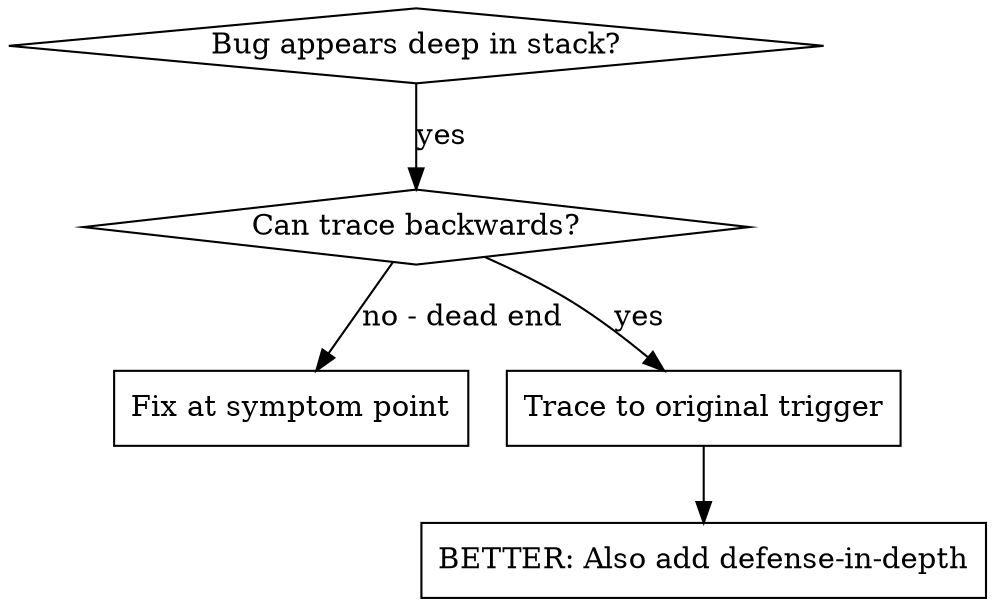
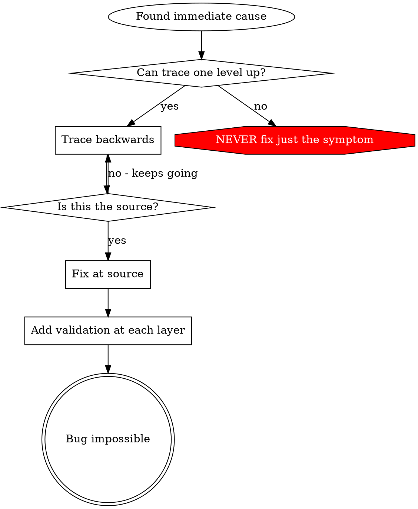

# Root Cause Tracing

## Overview

Bugs often manifest deep in the call stack (git init in wrong directory, file created in wrong location, database opened with wrong path). Your instinct is to fix where the error appears, but that's treating a symptom.

**Core principle:** Trace backward through the call chain until you find the original trigger, then fix at the source.

## When to Use



**Use when:**
- Error happens deep in execution (not at entry point)
- Stack trace shows long call chain
- Unclear where invalid data originated
- Need to find which test/code triggers the problem

## The Tracing Process

### 1. Observe the Symptom
```
Error: git init failed in ~/project/packages/core
```

### 2. Find Immediate Cause
**What code directly causes this?**
```typescript
await execFileAsync('git', ['init'], { cwd: projectDir });
```

### 3. Ask: What Called This?
```typescript
WorktreeManager.createSessionWorktree(projectDir, sessionId)
  → called by Session.initializeWorkspace()
  → called by Session.create()
  → called by test at Project.create()
```

### 4. Keep Tracing Up
**What value was passed?**
- `projectDir = ''` (empty string!)
- Empty string as `cwd` resolves to `process.cwd()`
- That's the source code directory!

### 5. Find Original Trigger
**Where did empty string come from?**
```typescript
const context = setupCoreTest(); // Returns { tempDir: '' }
Project.create('name', context.tempDir); // Accessed before beforeEach!
```

## Attaching a Debugger

When you can't trace manually, use the `debug` tool (DAP). It gets strictly better evidence than print-logging, with zero source edits and nothing to remove afterward:

Adapters ship built in — `gdb`, `lldb-dap`, `debugpy`, `dlv`, `rdbg`, `js-debug-adapter` and others — but auto-selection only considers the ones whose command actually resolves on this machine, and anything else comes from a `dap.json`. The TypeScript examples here run under vscode-js-debug, which is a separate install; a missing adapter fails with `No debugger adapter available. Installed adapters: …`, which is your signal to fall back to logging rather than yak-shave.

```
debug {action: "launch", program: ..., adapter: ..., file: ..., line: ...}   // start under the adapter
debug {action: "set_breakpoint", file: ..., line: ..., condition?: ...}     // line before the dangerous operation
debug {action: "continue"}                                                   // run to it
debug {action: "stack_trace"}                                                // the caller chain the grep was reconstructing
debug {action: "variables"} / debug {action: "evaluate", expression: ...}    // the state at that point
```

**Analyze the evidence:**
- `stack_trace` names every caller up to the test
- `variables` shows what was actually passed (`directory = ''`), not what you logged
- Repeat: does the same caller hit the same bad value every time?

**When logs are still right:** a process you cannot relaunch under an adapter (a production trace, a one-shot CI run whose environment you don't control), or output you need to keep in the record after the process exits. Then add the temporary logging, run, and remove it — but that is the fallback, not the default.

## Finding Which Test Causes Pollution

If something appears during tests but you don't know which test:

Use the bisection script `find-polluter.sh` in this directory:

```bash
./find-polluter.sh '.git' 'src/**/*.test.ts'
```

Runs tests one-by-one, stops at first polluter. See script for usage.

## Real Example: Empty projectDir

**Symptom:** `.git` created in `packages/core/` (source code)

**Trace chain:**
1. `git init` runs in `process.cwd()` ← empty cwd parameter
2. WorktreeManager called with empty projectDir
3. Session.create() passed empty string
4. Test accessed `context.tempDir` before beforeEach
5. setupCoreTest() returns `{ tempDir: '' }` initially

**Root cause:** Top-level variable initialization accessing empty value

**Fix:** Made tempDir a getter that throws if accessed before beforeEach

**Also added defense-in-depth:**
- Layer 1: Project.create() validates directory
- Layer 2: WorkspaceManager validates not empty
- Layer 3: NODE_ENV guard refuses git init outside tmpdir
- Layer 4: Stack trace logging before git init

## Key Principle



**NEVER fix just where the error appears.** Trace back to find the original trigger.

## Stack Trace Tips

**Default:** set a `debug` breakpoint before the dangerous operation — `stack_trace`, `variables`, and `evaluate` give the same facts with no edits to undo.
**Log-based fallback:** when the process can't run under an adapter, `console.error()` just before the operation (logger may be suppressed), include directory, cwd, environment variables, timestamps, and `new Error().stack` for the call chain — then remove the logging.

## Real-World Impact

From debugging session (2025-10-03):
- Found root cause through 5-level trace
- Fixed at source (getter validation)
- Added 4 layers of defense
- 1847 tests passed, zero pollution
